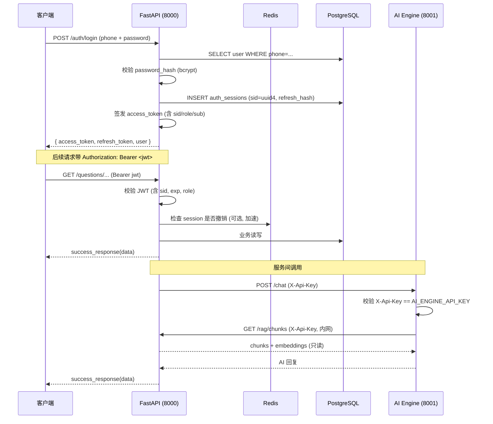
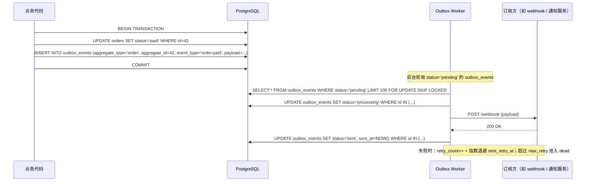
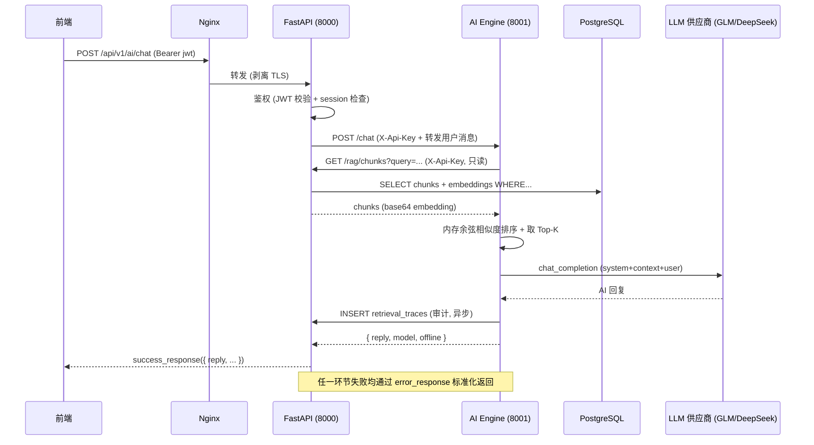

# 架构权威声明（Architecture Authority）

> 本文档为 SmartLearn AI 商用级审查报告 **P1-1「收敛后端架构与数据权威」** 的整改产出，明确以下数据权威、唯一标识、权限系统、迁移入口、领域事件模型、错误码规范与审计方式。后续所有重构、新增功能必须遵循本声明，禁止旁路写入或新增平行权威系统。

- **生效日期**：2026-07-13
- **审查报告对应项**：P1-1
- **维护方**：SmartLearn AI 后端团队
- **关联代码**：`services/api/app/core/error_codes.py`、`services/api/app/core/responses.py`、`services/api/app/core/exception_handler.py`

---

## 1. 架构方案选择

### 1.1 方案 A — FastAPI 为业务主服务（已选）

经对比单体内核 / 微服务 / Serverless 后，采用 **方案 A：FastAPI 作为业务权威 + AI Engine 作为推理域**。理由：

| 维度 | 方案 A（采用） | 方案 B（单体内核） | 方案 C（全微服务） |
|---|---|---|---|
| 业务权威收敛 | ✅ FastAPI 单一权威 | ✅ 但 AI 与业务耦合 | ❌ 多权威难收敛 |
| AI 推理隔离 | ✅ 独立进程/容器 | ❌ 同进程易互扰 | ✅ 但运维复杂 |
| 运维成本 | ✅ 中等 | ✅ 最低 | ❌ 最高 |
| 数据一致性 | ✅ 单库事务 | ✅ | ❌ 需分布式事务 |

### 1.2 职责划分（不可越界）

```
┌─────────────────────────────────────────────────────────────────┐
│  FastAPI (services/api)  — 业务权威 (port 8000)                  │
│  ├─ 用户/会话/权限/RBAC                                          │
│  ├─ 支付订单/订阅/VIP 状态机                                     │
│  ├─ 审计日志 (AuditLog) / 检索追踪 (RetrievalTrace)              │
│  ├─ 题库/词汇/知识点/教材/内容资产                                │
│  ├─ RAG 索引元数据 (KnowledgeDocument / DocumentChunk)           │
│  └─ 领域事件 Outbox (OutboxEvent) — 唯一对外事件发布源           │
└─────────────────────────────────────────────────────────────────┘
                              ▲ HTTP (X-Api-Key 鉴权)
                              │
┌─────────────────────────────────────────────────────────────────┐
│  AI Engine (services/ai-engine) — 推理域 (port 8001, 内网)       │
│  ├─ RAG 检索（调用 API 读 chunk + embedding）                    │
│  ├─ LLM 对话 / 题目解析 / 学习计划                                │
│  ├─ 手写批改 / 单词游戏 / 图像生成                                │
│  ├─ Prompt 模板管理（自管表，不写业务核心表）                     │
│  └─ 禁止直接写：users / orders / audit_logs / content_assets     │
└─────────────────────────────────────────────────────────────────┘
```

**铁律**：
- AI Engine **禁止直连业务数据库写入核心表**（users / orders / subscriptions / audit_logs / content_assets / outbox_events）。如需回写业务状态（如答题事件、词汇进度），必须通过 HTTP 调用 API 的受限端点；
- AI Engine 可读 chunk + embedding（只读副本或同一库的只读角色），但写操作必须走 API；
- 前端 NestJS 服务（如存在历史代码）**已废弃**，所有业务请求统一经 FastAPI。

---

## 2. 唯一标识定义

| 标识类型 | 字段位置 | 类型 | 生成规则 | 备注 |
|---|---|---|---|---|
| **用户 ID** | `users.id` | Integer PK, 自增 | DB 自增 | 全平台唯一用户标识，禁用 phone/email/openid 作为主键 |
| **会话 ID** | `auth_sessions.session_id` | UUID (字符串) | `uuid4().hex` | 与 JWT `sid` claim 对应；用于会话级撤销 |
| **订单号** | `orders.order_no` | String(64) | `SL` + `timestamp` + `random` | 形如 `SL20260713-143052-a3f9c1`；商户订单号，对用户/三方唯一 |
| **内容资产 ID** | `content_assets.id` | Integer PK, 自增 | DB 自增 | 内容版权台账唯一标识 |
| **文档 ID** | `knowledge_documents.id` | Integer PK, 自增 | DB 自增 | RAG 文档级元数据；`doc_ref_id` 字段为外部引用（可为空） |
| **审计日志 ID** | `audit_logs.id` | Integer PK, 自增 | DB 自增 | 管理员操作审计唯一标识 |
| **检索追踪 ID** | `retrieval_traces.id` | Integer PK, 自增 | DB 自增 | AI 检索路径审计；`request_id` 关联前端 trace |
| **Outbox 事件 ID** | `outbox_events.id` | Integer PK, 自增 | DB 自增 | 事务性 Outbox 唯一标识 |

### 2.1 命名规范

- 数据库表名：复数 + snake_case（如 `users`、`audit_logs`、`outbox_events`）；
- 状态字段：单数小写 snake_case（如 `status='paid'`、`role='admin'`）；
- 时间戳：`created_at` / `updated_at` / `expires_at`，统一 `DateTime`（无时区，沿用项目既有风格）；
- JSON 字段：`metadata_json`（Text 存 JSON 字符串）或 `details`（JSONB，如 audit_logs）。

---

## 3. 权限系统（RBAC）

### 3.1 用户角色枚举

定义于 `app.models.user.User.role`：

| role 值 | 含义 | 可访问范围 |
|---|---|---|
| `user` | 普通学习者（默认） | 个人资料、订阅、答题、AI 对话、词汇进度 |
| `teacher` | 教师 | `user` 全部 + 班级管理（如未来启用）、学生进度查看 |
| `admin` | 平台管理员 | 全部业务表读写 + 系统配置 + 用户封禁/解封 + VIP 调整 |
| `super_admin` | 超级管理员 | `admin` 全部 + 管理员账号管理 + 审计日志查看 |

便捷属性（已实现在 `User` 模型）：
- `User.is_admin` → `role in ("admin", "super_admin")`
- `User.is_super_admin` → `role == "super_admin"`
- `User.is_banned` → `status == "banned"`

### 3.2 用户状态枚举

定义于 `app.models.user.User.status`：

| status 值 | 含义 | 行为 |
|---|---|---|
| `active` | 正常 | 可登录、可调用所有授权接口 |
| `banned` | 封禁 | 禁止登录（返回 `AUTH_ACCOUNT_BANNED`），现有 token 通过会话撤销失效 |

### 3.3 VIP 等级

定义于 `User.vip_level`（0-3，由 admin 手动调整）：

| vip_level | 含义 | 配额覆盖 |
|---|---|---|
| 0 | 普通 | 走订阅默认配额 |
| 1 | 基础 VIP | 走订阅配额，可被 `ai_quota_daily_override` 覆盖 |
| 2 | 高级 VIP | 同上 |
| 3 | 至尊 VIP | 同上 |

`vip_expire_at` 为 NULL 表示永久；过期后 `vip_level` 自动降级为 0（由 APScheduler 定时任务处理）。

### 3.4 鉴权流程（Mermaid sequenceDiagram）



---

## 4. 数据库迁移入口

### 4.1 唯一入口

- **迁移工具**：Alembic
- **入口目录**：`services/api/alembic/`
- **配置文件**：`services/api/alembic.ini`
- **环境脚本**：`services/api/alembic/env.py`（已配置 `app.core.config.settings.database_url_sync`，使用 psycopg2 同步驱动）

### 4.2 迁移链（单一来源，禁止旁路）

| 版本 | 文件 | 内容 |
|---|---|---|
| 001 | `001_initial_schema.py` | 初始 schema：users / subscriptions / knowledge_points / questions / vocabulary_words / user_word_progress / user_question_attempts / wrong_questions / ai_conversations / game_sessions / user_game_profiles |
| 002 | `002_user_profile_vip_status.py` | User 增补字段（vip_level / vip_expire_at / ai_quota_daily_override / role / status） |
| 003 | `003_add_word_game_sessions.py` | 单词游戏会话表 word_game_sessions |
| 004 | `004_add_game_id_subject_answered.py` | 游戏会话补充字段（game_id / subject / answered） |
| 005 | `005_add_wrong_question_review_fields.py` | 错题复习字段（review_count / last_reviewed_at / next_review_at / mastery_level） |
| 006 | `006_add_p0_p1_tables.py` | P0/P1 整改表：auth_sessions / audit_logs / content_assets / content_takedown_requests / orders / order_events / outbox_events / knowledge_documents / document_chunks / embedding_jobs / index_versions / retrieval_traces |

**铁律**：
- 所有 schema 变更必须通过 `alembic revision --autogenerate` 生成新版本，并人工核对 `upgrade()` / `downgrade()`；
- 禁止直接在数据库手动 `ALTER TABLE`（除非紧急 hotfix 且事后补迁移）；
- 禁止 AI Engine 自建表（如需新表，提 PR 到 API 仓库并新增 alembic 版本）；
- 迁移文件命名规范：`NNN_<snake_case_description>.py`（NNN 为递增编号，从 007 继续）。

### 4.3 常用命令

```bash
# 在 services/api 目录下执行
cd services/api

# 生成新迁移（自动检测 ORM 变更）
alembic revision --autogenerate -m "add_xxx_table"

# 升级到最新版本
alembic upgrade head

# 回滚一个版本
alembic downgrade -1

# 查看当前版本
alembic current

# 查看迁移历史
alembic history
```

---

## 5. 领域事件模型（事务性 Outbox）

### 5.1 OutboxEvent 表

定义于 `app.models.order.OutboxEvent`，与业务变更**同事务**写入，由后台 worker 异步投递。

| 字段 | 类型 | 说明 |
|---|---|---|
| `id` | Integer PK | 自增主键 |
| `aggregate_type` | String(50) | 聚合根类型：`order` / `subscription` / `user` / `content` |
| `aggregate_id` | Integer | 聚合根 ID（如 order_id / user_id） |
| `event_type` | String(50) | 事件类型，命名规范见 5.2 |
| `payload` | Text (JSON) | 事件载荷（JSON 字符串） |
| `status` | String(20) | `pending` / `processing` / `sent` / `failed` / `dead` |
| `retry_count` | Integer | 已重试次数 |
| `max_retry` | Integer | 最大重试次数（默认 5） |
| `last_error` | Text | 最近一次错误信息 |
| `next_retry_at` | DateTime | 下次重试时间（指数退避） |
| `sent_at` | DateTime | 实际投递成功时间 |

### 5.2 事件命名规范

格式：`<domain>.<action>`（全小写 snake_case）

| aggregate_type | event_type 示例 | 触发时机 |
|---|---|---|
| `order` | `order.created` | 订单创建 |
| `order` | `order.paid` | 支付回调成功（status: created→paid） |
| `order` | `order.refunded` | 全额退款完成 |
| `order` | `order.refund_pending` | 部分退款异步处理中 |
| `order` | `order.closed` | 订单关闭（用户/管理员） |
| `subscription` | `subscription.activated` | 订阅激活 |
| `subscription` | `subscription.expired` | 订阅到期 |
| `subscription` | `subscription.renewed` | 订阅续费 |
| `user` | `user.banned` | 用户被封禁 |
| `user` | `user.unbanned` | 用户解封 |
| `user` | `user.role.updated` | 用户角色变更 |
| `content` | `content.taken_down` | 内容下架 |
| `content` | `content.restored` | 内容恢复 |

### 5.3 事件投递流程（Mermaid sequenceDiagram）



---

## 6. 错误码规范

详见 `services/api/app/core/error_codes.py`。摘要：

| 类别 | 段位 | 示例 | 默认 HTTP |
|---|---|---|---|
| 认证类 | 1xxx | `AUTH_INVALID_CREDENTIALS` (1001) | 401 / 403 |
| 参数类 | 2xxx | `PARAM_INVALID` (2001) | 400 |
| 资源类 | 3xxx | `RESOURCE_NOT_FOUND` (3001) | 404 |
| 业务类 | 4xxx | `BIZ_QUOTA_EXCEEDED` (4001) | 429 / 402 / 451 |
| 系统类 | 5xxx | `SYS_INTERNAL_ERROR` (5001) | 500 / 503 |

**响应格式**（详见 `services/api/app/core/responses.py`）：

```json
// 成功
{"success": true, "data": {...}, "message": "success"}

// 失败
{
  "success": false,
  "error": {
    "code": "AUTH_TOKEN_INVALID",
    "code_number": 1003,
    "message": "无效的身份凭证",
    "details": null
  }
}
```

**异常处理**（详见 `services/api/app/core/exception_handler.py`）：
- `BizError` → 标准错误响应（HTTP 状态码来自 `BizError.http_status`）
- `HTTPException` → 按 `HTTP_STATUS_TO_ERROR_CODE` 映射为最贴近的 ErrorCode
- `RequestValidationError` (422) → `PARAM_INVALID` + `details.errors`
- 未捕获 `Exception` → `SYS_INTERNAL_ERROR` (500)，**响应体不泄露堆栈**

**注册方式**（在 `app/main.py` 中调用一次）：
```python
from app.core.exception_handler import register_exception_handlers
register_exception_handlers(app)
```

---

## 7. 审计方式

### 7.1 管理员操作审计 — `AuditLog` 表

定义于 `app.models.audit_log.AuditLog`，记录所有管理员写操作。

| 字段 | 类型 | 说明 |
|---|---|---|
| `id` | Integer PK | 自增 |
| `actor` | String(255) | 操作者展示名（如 `admin@x.com`），索引 |
| `actor_id` | Integer | 操作者 user_id（便于按管理员筛选） |
| `action` | String(100) | 动作类型（如 `user.ban` / `user.role.update` / `system.config.update`），索引 |
| `target` | String(255) | 操作目标（如 `user:42`） |
| `details` | JSONB | 详细变更内容（before/after 等） |
| `created_at` | DateTime | 时间戳，索引 |

**审计触发点**（必须记录）：
- 用户封禁 / 解禁
- 用户角色变更
- 用户 VIP 等级 / 配额手动调整
- 系统配置更新（功能开关、邮件配置等）
- 内容下架 / 恢复
- 题库 / 词汇 / 知识点的批量导入或删除
- 订单的人工状态变更（如手动置为已退款）

### 7.2 AI 检索追踪 — `RetrievalTrace` 表

定义于 `app.models.rag_index.RetrievalTrace`，记录 AI 每次检索的路径，用于效果分析与召回审计。

| 字段 | 类型 | 说明 |
|---|---|---|
| `id` | Integer PK | 自增 |
| `request_id` | String(64) | 关联前端 trace_id，索引 |
| `user_id` | Integer | 发起检索的用户 ID（可空，匿名检索时） |
| `query` | Text | 用户查询原文 |
| `retrieved_chunk_ids` | Text (JSON) | 命中的 chunk_id 列表 |
| `scores` | Text (JSON) | 各 chunk 的相似度分数 |
| `model` | String(100) | 使用的 LLM 模型名 |
| `prompt_hash` | String(64) | Prompt 模板 hash（用于版本追踪） |
| `cost_tokens` | Integer | 本次请求的 token 消耗 |
| `latency_ms` | Integer | 端到端延迟（毫秒） |
| `created_at` | DateTime | 时间戳 |

**审计用途**：
- 召回质量分析（结合点击/反馈数据评估 chunk 有效性）
- Prompt 版本回归（不同 prompt_hash 的效果对比）
- 成本核算（cost_tokens 求和）
- P95 延迟监控（latency_ms 百分位）
- 用户行为审计（user_id + query）

### 7.3 订单状态流转审计 — `OrderEvent` 表

定义于 `app.models.order.OrderEvent`，记录订单每次状态变更。

| 字段 | 类型 | 说明 |
|---|---|---|
| `id` | Integer PK | 自增 |
| `order_id` | Integer FK → orders.id | 订单 ID，索引 |
| `from_status` | String(20) | 变更前状态 |
| `to_status` | String(20) | 变更后状态 |
| `event_type` | String(30) | `create` / `pay_callback` / `close` / `refund` / `refund_callback` / `admin_op` |
| `operator_id` | Integer | 操作人（admin_op 时） |
| `note` | Text | 备注 |
| `created_at` | DateTime | 时间戳 |

**状态机**（详见 `Order` 模型 docstring）：
```
created -> paid            (支付回调成功)
created -> closed          (用户/管理员关闭未支付订单)
created -> failed          (超时/失败)
paid    -> refunded        (全额退款)
paid    -> refund_pending  (部分退款/异步退款处理中)
```

---

## 8. 服务间通信

### 8.1 通信方式

- **协议**：HTTP/HTTPS（同 docker network 内 HTTP 即可；跨网络走 HTTPS）
- **方向**：API → AI Engine（单向，AI Engine 不主动回调 API 业务端点，仅按需读 chunk）
- **鉴权**：请求头 `X-Api-Key: <AI_ENGINE_API_KEY>`（环境变量注入，compose 同步）
- **不共享数据库直连**：AI Engine 配置 `DATABASE_URL` 仅用于只读查询 chunk + embedding，**禁止写操作**

### 8.2 鉴权优先级（AI Engine 侧）

详见 `services/ai-engine/app/auth.py`：

1. **JWT 优先**：若请求带 `Authorization: Bearer <jwt>`，校验通过（复用 `JWT_SECRET`）→ 识别用户身份（role/sub），用于用户级限流/排行榜；
2. **X-Api-Key 兜底**：无 JWT 时校验 `X-Api-Key` → 服务间身份（role=service），用于 API 内部调用；
3. **校验失败** → 401。

**写接口额外校验**（`require_service_or_admin`）：
- 仅允许 service key 或 `role=admin` 的 JWT；
- 普通用户 JWT → 403（如修改 prompt 模板）。

### 8.3 数据流

```
客户端 (Web/Mobile)
    │
    │ HTTPS
    ▼
Nginx (反向代理 + TLS 终止)
    │
    ├──► FastAPI (services/api, port 8000)  [业务权威]
    │        │
    │        │ HTTP (X-Api-Key, 内网)
    │        ▼
    │    AI Engine (services/ai-engine, port 8001, 仅监听 127.0.0.1 或内网)
    │        │
    │        │ HTTP (X-Api-Key, 只读)
    │        ▼
    │    FastAPI /rag/chunks (只读 chunk + embedding)
    │
    │    PostgreSQL (单一实例, API 写 + AI Engine 只读)
    │    Redis (会话/限流/缓存)
    │
    ▼
第三方（GLM / DeepSeek / SiliconFlow / CogView / 支付网关）
```

### 8.4 调用契约（Mermaid sequenceDiagram）



---

## 9. 落地检查清单（CI / Code Review）

新增功能 PR 必须自检以下项目（CI 自动 lint + 人工 review）：

- [ ] 所有新表通过 alembic 迁移创建（不手动 DDL）
- [ ] 所有 API 端点返回 `success_response` / `error_response` / `paginated_response` 标准格式
- [ ] 业务异常通过 `raise BizError(ErrorCode.XXX)` 抛出，不直接 `raise HTTPException`
- [ ] 错误码未在枚举外硬编码字符串（前端依赖枚举值做 i18n）
- [ ] 管理员写操作记录 `AuditLog`（含 before/after）
- [ ] AI Engine 不直接写业务核心表（仅通过 HTTP 调 API）
- [ ] Outbox 事件与业务变更**同事务**写入（不跨事务，避免事件丢失）
- [ ] 新增 ErrorCode 时同步更新 `error_codes.py` 的 3 个映射表（`_ERROR_CODE_NUMBERS` / `_DEFAULT_HTTP_STATUS` / `_DEFAULT_MESSAGES`）
- [ ] 单元测试覆盖新错误码与异常处理路径

---

## 10. 变更历史

| 日期 | 版本 | 变更内容 | 负责人 |
|---|---|---|---|
| 2026-07-13 | v1.0 | 初稿，落地 P1-1 整改项（错误码 / 响应格式 / 异常处理器 / 架构权威声明） | 寇豆码 |

---

**附录 A：相关文件清单**

| 文件 | 作用 |
|---|---|
| `services/api/app/core/error_codes.py` | 统一错误码枚举 + BizError + HTTP 状态码映射 |
| `services/api/app/core/responses.py` | 统一响应包装函数（success / error / paginated） |
| `services/api/app/core/exception_handler.py` | 全局异常处理器注册函数 |
| `services/api/app/models/user.py` | User 模型（role / status / vip_level） |
| `services/api/app/models/auth_session.py` | AuthSession 模型（session_id / 撤销） |
| `services/api/app/models/order.py` | Order / OrderEvent / OutboxEvent 模型 |
| `services/api/app/models/audit_log.py` | AuditLog 模型 |
| `services/api/app/models/rag_index.py` | RetrievalTrace 模型（AI 检索审计） |
| `services/api/app/models/content_asset.py` | ContentAsset 模型（内容版权台账） |
| `services/api/alembic/` | 数据库迁移唯一入口（001-006） |
| `services/ai-engine/app/auth.py` | AI Engine 鉴权（JWT + X-Api-Key） |

**附录 B：废弃说明**

- NestJS 前端服务（如历史代码中存在）：**已废弃**，所有业务请求统一经 FastAPI；
- 任何绕过 `error_response` 直接返回裸 dict 的旧端点：在重构时逐步替换为标准格式（不阻塞本次 P1-1 验收）。
