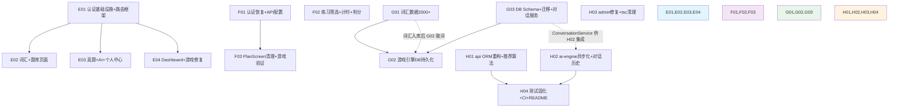

# SmartLearn AI 第二轮增量优化设计

> 文档版本: v1.0 ｜ 日期: 2026-07-08 ｜ 作者: 高见远（架构师）
> 依据:
> - 《优化PRD-2026-07-08.md》（44 条需求，四维度）
> - 《全量代码审查报告-2026-07-08.md》（原始审查）
> - 《整改设计-2026-07-08.md》（第一轮设计，了解已有架构）
> 主理人已拍板决策（直接采纳，不再问用户）:
> 1. 真题模拟：student-web 前端直接读 `data/exam-papers/*-sample.json`（不新增后端路由）
> 2. 词汇来源：用 CET4 核心词汇 + 考研高频词汇公开词表生成 2000+ 条真实词条
> 3. AI 对话历史：本轮实现（ORM 已有 `ai_conversations` 表定义）
> 4. A-P1-1（cogview fail-closed）和 A-P1-2（moderation fail-closed）已在第一轮修复，本轮无需重复
>
> **范围声明**: 本轮为全面功能完善，补全真实业务功能、扩充真实数据、打通端到端流程。无代码产出，仅有设计与任务分解。

---

## 1. 实现方案与框架选型

框架选型**不变**：前端 React 系（student-web=React+Vite+Tailwind、mobile=React Native+Expo、admin=React+AntD）、后端 FastAPI+SQLAlchemy2.0(async)+Alembic（api）/ FastAPI+多供应商抽象层（ai-engine）。本轮对各"能跑但空心"的模块做功能填实。

### 1.1 组E — student-web 前端补全

**核心挑战**：student-web 当前仅 5 个游戏路由，无任何学习功能页，无登录鉴权，`client.ts` 硬编码 `userId='student_001'`。

**技术方案**：

- **认证体系**：新增 `AuthContext`（React Context）管理登录态，token 存 `localStorage`；为现有 axios `client` 实例添加请求拦截器（注入 `Authorization: Bearer <token>`）和响应拦截器（401 清除 token 并跳转 `/login`）；路由层用 `<ProtectedRoute>` 包裹受保护页面，未登录重定向 `/login`。
- **功能页面**（6 个新页面 + 1 个 Dashboard）：
  - **Login**：表单提交调 `POST /api/v1/auth/login`，成功后存 token + 调 `GET /api/v1/auth/me` 获取用户信息，导航到 Dashboard。
  - **Dashboard**：学习总览，调 `/api/v1/vocab/progress` + `/api/v1/statistics/overview` 展示进度卡片 + 快捷入口。
  - **VocabLearning**：翻卡学习（正面单词+音标，背面释义+例句），调 `/api/v1/vocab/words` 分页加载、`/api/v1/vocab/progress` 提交学习事件、`/api/v1/vocab/due` 获取待复习词。
  - **QuestionPractice**：题库刷题，调 `/api/v1/questions` 列表 + `/api/v1/questions/{id}` 详情 + `POST /api/v1/questions/{id}/attempt` 提交判分。
  - **PastExam**：真题模拟，前端直接 `fetch('/exam-papers/math-sample.json')` 读取样例卷 JSON（文件放置在 `public/exam-papers/`），展示试卷→答题→查看解析。不新增后端路由。
  - **AITutor**：AI 对话，调 ai-engine `POST /chat`（经 nginx 代理），展示对话气泡流，支持上下文。
  - **Profile**：个人中心，调 `/api/v1/auth/me` 展示用户信息 + `/api/v1/statistics/user` 展示学习统计 + 退出登录。
- **导航布局**：新增 `Layout` 组件（顶部导航栏 + 侧边/底部功能入口），所有页面共享。
- **游戏修复**：
  - `GameResult`「再来一局」改为携带原 `gameId` 重新开始同款游戏（当前跳回 `/` 大厅）。
  - `CrossSubjectGame` 数学类题目改用 `MathQuestionCard` 渲染公式（当前用 `QuestionCard` 导致 LaTeX 不渲染）。
  - `client.ts` 的 `startGame` 传 `game_id` 参数（当前仅传 `game_type`，同类游戏内容一致）。

### 1.2 组F — mobile 修复

**核心挑战**：mobile 路由/页面齐全但多处功能断裂——登录态不恢复、计算题判分恒错、练习筛选未传参、BASE_URL 硬编码、PlanScreen 死代码。

**技术方案**：

- **checkAuth 启动恢复**（F-P0-3）：在 `RootNavigator` 组件挂载时（`useEffect`）调用 `useAuthStore.getState().checkAuth()`，从 `expo-secure-store` 恢复 token + 用户信息；恢复期间显示 Loading/Splash；恢复完成后根据 `isAuthenticated` 决定渲染 Auth 还是 Main 导航器。当前 `RootNavigator` 仅读 `isAuthenticated` 不恢复，导致重启后登录态丢失。
- **CalculateQuestion 判分**（F-P0-4）：计算题组件新增 `TextInput` 供用户输入答案；「查看答案」按钮改为先提交用户实际输入（非空串 `''`）再展示参考答案+解析；判分对比 `userAnswer.strip().lower()` 与 `question.answer.strip().lower()`。
- **apiClient BASE_URL 可配置**（F-P0-5）：`BASE_URL` 改为从 `Constants.expoConfig?.extra?.apiBaseUrl` 或环境变量读取（Expo 标准方式），开发环境指向 `http://<dev-ip>:8000/api/v1`，生产环境可配置正式地址。在 `app.json` 的 `extra` 字段或 `app.config.js` 中配置。
- **LearnScreen 筛选+计时**（F-P1-1/F-P1-2）：将构造的 `params`（含 `type` 筛选）传入 `questionService.getRandomQuestions(count, params)` 调用（当前构造了 params 但未传）；`loadQuestions` 完成后立即 `setStartTime(Date.now())`，修复首题 `timeSpent` 天文数字。
- **PlanScreen 清理**（F-P1-3）：确认 `PlanScreen` 未被任何 Navigator 注册→删除文件，同步清理 `word/index.ts` 中的导出。
- **mobile 游戏验证**（G-P1-4/G-P0-3）：验证 MatchGame/SpellGame/WordRainGame 三种游戏流程完整；验证 AchievementPopup + Lottie 动画正常渲染（第一轮已补 `lottie-react-native` 依赖）。

### 1.3 组G — 数据 + 游戏引擎

**核心挑战**：词汇仅 ~520 条（目标 2000+）；ai-engine `word_games_service` 词库仅 15 个硬编码单词；session/leaderboard 进程内内存（跨 worker 丢失、重启清零）。

**技术方案**：

- **词汇数据扩充至 2000+ 条**（W-P0-1/W-P0-3）：
  - 新增 `data/vocabulary/cet4-core.json`（~1200 条 CET4 核心词汇）
  - 新增 `data/vocabulary/kaoyan-high-freq.json`（~800 条考研高频词汇，与 CET4 去重）
  - 每条字段对齐 `VocabularyWord` ORM：`word_id`/`headword`/`meaning`/`phonetic`/`tags`/`frequency`/`synonyms`/`antonyms`/`examples`
  - 词条含真实单词/音标/释义/至少 1 例句，以 CET4/考研公开词表为基础生成
  - 拆分多文件便于维护，`import_vocabulary.py`（第一轮已重构为 ORM）可直接灌入
- **word_games_service 动态取词**（F-P0-6/W-P0-2）：
  - `_init_word_bank` 改为从数据库 `vocabulary_words` 表（或 data/vocabulary JSON）动态加载
  - 按 `difficulty` 映射 `frequency` 区间：easy→frequency≥4，medium→frequency 2-3，hard→frequency 1
  - 游戏开始时从 2000+ 词库随机取词；选择题干扰项从同难度词库取
  - 删除 15 个硬编码单词
- **session/leaderboard 持久化到 DB**（F-P0-7/G-P0-2）：
  - ai-engine 新增 DB 连接模块（`asyncpg` 连接池，复用 api 的 PostgreSQL `DATABASE_URL`）
  - 新增 `word_game_sessions` 表存储活跃会话状态（words JSON、current_index、score 等），实现跨 worker可恢复
  - 游戏结束后：写入 `game_sessions` 表（最终成绩）+ 更新 `user_game_profile`（XP/金币）+ 标记 `word_game_sessions` 为 inactive
  - 排行榜从 `game_sessions` 表聚合查询（`SELECT user_id, MAX(score) ... GROUP BY user_id ORDER BY score DESC`）
  - 删除进程内 `_sessions`/`_leaderboard` 字典
- **AI 对话历史保存**（A-P1-5）：
  - 新增 `ConversationService`，chat 完成后将对话保存到 `ai_conversations` 表（ORM 已定义）
  - **注意**：此功能的 chat_router.py 集成部分归入组H（因组H 需修改 chat_router.py 做异步化，两处修改合并避免文件冲突）；组G 负责 `ConversationService` + DB 模块的新建

> **文件冲突规避**：`chat_router.py` 同时涉及"AI对话历史保存"（组G 逻辑）和"异步化"（组H 改造）。为保持组间无文件冲突，`ConversationService` 和 `db.py` 由组G 新建（新文件），`chat_router.py` 的修改（异步化 + 调用 ConversationService）统一归入组H。

### 1.4 组H — 后端质量 + 异步 + 测试 CI

**核心挑战**：api 业务路由用内联 raw `Table()` 而非 ORM；questions /recommend 实为 `ORDER BY random()`；games.get_game_detail 引用不存在字段；ai-engine LLM 调用同步阻塞事件循环；admin 5 处裸 fetch 不带鉴权 + tsc 可能失败；无 CI。

**技术方案**：

- **api ORM 重构**（F-P1-6）：
  - `vocab.py`/`questions.py`/`games.py` 中所有内联 `Table(...)` + `MetaData()` 定义删除
  - 改用 `from app.models.business import VocabularyWord, Question, GameSession, UserGameProfile, UserWordProgress, WrongQuestion, UserQuestionAttempt` ORM 模型查询
  - 查询从 `select(vw.c.xxx)` 改为 `select(VocabularyWord.xxx)` / `select(Question).where(...)`
  - 保持现有 API 响应格式不变（仅内部实现从 raw Table → ORM）
- **recommend 算法**（F-P1-7）：
  - 实现真实推荐：查用户错题本（`wrong_questions` 表）→ 关联题目优先推荐
  - 查用户低掌握度知识点（`user_word_progress` / `user_question_attempts`）→ 关联题目
  - 排除最近 N 天内已答对的题目（`user_question_attempts`）
  - 若无足够个性化数据，回退到按难度匹配 + 随机（但不再纯 `ORDER BY random()`）
- **games 字段对齐**（F-P1-8）：
  - `get_game_detail` 引用 `base.type/icon/min_level/subject/config` 但 `GameConfigResponse` 不含这些字段
  - 方案：`GameConfigResponse` 补齐 `type`/`icon`/`min_level`/`subject`/`config` 字段（从 games-config.json 对应字段读取），或 `get_game_detail` 不引用不存在字段
  - 优先补齐 schema 字段（更完整），从 JSON 配置中读取 `type`/`icon`/`min_level`/`subject`/`config`
- **ai-engine 异步化**（A-P0-1）：
  - `openai_compat.py`：`OpenAI` 同步客户端改为 `AsyncOpenAI`；`chat_completion`/`generate_embedding` 改为 `async def` + `await client.chat.completions.create(...)`；流式改为 `AsyncGenerator` + `async for`
  - `providers/router.py`（AIRouter）：`chat_completion`/`generate_embedding`/`text_to_speech`/`moderate` 等改为 `async def`，内部 `await provider.xxx()`
  - `llm_service.py`：`chat`/`generate_explanation`/`generate_study_plan` 改为 `async def`，`await self._router.chat_completion(...)`
  - `chat_router.py`/`rag_router.py`/`study_router.py`/`media_router.py`：将同步调用改为 `await llm.chat(...)` / `await llm.generate_explanation(...)`
  - GLM/DeepSeek 供应商继承 `OpenAICompatProvider`，异步化自动覆盖
  - 设置 `timeout`/`max_retries`：`AsyncOpenAI(api_key=..., base_url=..., timeout=30, max_retries=2)`
- **AI 对话历史保存集成**（A-P1-5）：
  - `chat_router.py` 异步化同时集成 `ConversationService`：chat 完成后 `await conversation_service.save(user_id, messages, reply, provider, model)`
  - 新增 `GET /chat/history` 端点（可选）：查询用户历史对话
- **Alembic env.py 修复**（A-P1-4）：
  - `env.py` 的 `target_metadata` 导入 `app.models` 全部模型，使 `alembic revision --autogenerate` 能检测全部表变更
- **admin 裸 fetch 修复**（F-P1-4）：
  - 5 处裸 `fetch()` 统一改用已有 axios `request` 实例（自动带 Authorization）：
    - `wordService.ts:48` → `request.get('/words/export', { params, responseType: 'blob' })`
    - `userService.ts:58` → `request.get('/v1/users/export', { params, responseType: 'blob' })`
    - `questionService.ts:45` → `request.get('/questions/export', { params, responseType: 'blob' })`
    - `statisticsService.ts:73` → `request.get('/statistics/export/${type}', { params, responseType: 'blob' })`
    - `WorkbookDetail.tsx:54` → `api.get(`/questions/${qId}`)`
- **admin tsc 清理**（F-P1-5）：
  - 运行 `npx tsc --noEmit`，清理全部 `noUnusedLocals`/`noUnusedParameters` 报错
  - 移除未使用的 import / 变量 / 参数
- **测试固化**（A-P0-2）：
  - 将 QA 隔离单测（SSRF `is_safe_url` / JWT `validate` / restore 白名单 / vocab case）固化进 `services/*/tests/`
  - 新增 api 鉴权/判分单测：`services/api/tests/test_auth.py`、`test_questions.py`、`test_vocab.py`
  - 新增 ai-engine 异步 provider 单测：`services/ai-engine/tests/test_async_providers.py`
- **CI 工作流**（A-P0-3）：
  - 新增 `.github/workflows/ci.yml`：PR/push 触发 → `py_compile` 全 .py + JSON 解析校验 + `pytest services/` 单测 + `npx tsc --noEmit`（admin）
- **README 更新**（A-P1-7）：
  - 词汇规模从 ~520 更新为 2000+；更新功能清单（student-web 新增页面）

---

## 2. 文件列表（相对路径 + 动作）

> 动作图例：**改**=修改　**增**=新增　**删**=删除　**确**=确认/无改动

### 组E student-web 前端补全

| 相对路径 | 动作 | 说明 |
|---|---|---|
| `apps/student-web/src/contexts/AuthContext.tsx` | 增 | 认证 Context：管理 token/user 状态，提供 login/logout/getToken |
| `apps/student-web/src/api/client.ts` | 改 | 添加请求拦截器（注入 Authorization）+ 响应拦截器（401 跳登录）；startGame 传 game_id |
| `apps/student-web/src/api/auth.ts` | 增 | 认证 API 封装：login/register/getMe/logout |
| `apps/student-web/src/api/vocab.ts` | 增 | 词汇 API 封装：getWords/getProgress/getDueWords/submitEvent |
| `apps/student-web/src/api/questions.ts` | 增 | 题目 API 封装：getQuestions/getQuestionDetail/submitAttempt |
| `apps/student-web/src/api/statistics.ts` | 增 | 统计 API 封装：getOverview/getUserStats |
| `apps/student-web/src/api/ai.ts` | 增 | AI 对话 API 封装：chat（调 ai-engine /chat） |
| `apps/student-web/src/components/Layout.tsx` | 增 | 导航布局：顶部导航栏 + 内容区，所有页面共享 |
| `apps/student-web/src/components/ProtectedRoute.tsx` | 增 | 路由守卫：未登录重定向 /login |
| `apps/student-web/src/pages/Login.tsx` | 增 | 登录页：表单提交调 /auth/login |
| `apps/student-web/src/pages/Dashboard.tsx` | 增 | 学习总览：进度卡片 + 功能入口 |
| `apps/student-web/src/pages/VocabLearning.tsx` | 增 | 词汇学习：翻卡 + SRS 复习提醒 + 生词本 |
| `apps/student-web/src/pages/QuestionPractice.tsx` | 增 | 题库练习：列表 + 答题 + 判分 |
| `apps/student-web/src/pages/PastExam.tsx` | 增 | 真题模拟：前端读 public/exam-papers/*-sample.json |
| `apps/student-web/src/pages/AITutor.tsx` | 增 | AI 辅导：对话界面调 ai-engine /chat |
| `apps/student-web/src/pages/Profile.tsx` | 增 | 个人中心：用户信息 + 统计 + 退出登录 |
| `apps/student-web/src/App.tsx` | 改 | 路由更新：新增登录/仪表盘/词汇/题库/真题/AI/个人中心路由 + ProtectedRoute |
| `apps/student-web/src/main.tsx` | 改 | 包裹 AuthProvider + BrowserRouter（如未包裹） |
| `apps/student-web/src/pages/GameResult.tsx` | 改 | 「再来一局」携带原 gameId 重开同款游戏 |
| `apps/student-web/src/pages/CrossSubjectGame.tsx` | 改 | 数学题改用 MathQuestionCard 渲染公式 |
| `apps/student-web/public/exam-papers/math-sample.json` | 增 | 复制 data/exam-papers/math-sample.json 到 public 供前端读取 |
| `apps/student-web/public/exam-papers/english-sample.json` | 增 | 复制 data/exam-papers/english-sample.json 到 public 供前端读取 |

### 组F mobile 修复

| 相对路径 | 动作 | 说明 |
|---|---|---|
| `apps/mobile/src/navigation/RootNavigator.tsx` | 改 | useEffect 调 checkAuth() 恢复登录态；恢复期显示 Loading |
| `apps/mobile/src/services/apiClient.ts` | 改 | BASE_URL 改为从 Constants.expoConfig.extra.apiBaseUrl 读取 |
| `apps/mobile/app.json` | 改 | extra 字段加 apiBaseUrl 配置（开发/生产环境） |
| `apps/mobile/src/components/question/CalculateQuestion.tsx` | 改 | 新增 TextInput 输入答案；查看答案时提交实际输入非空串 |
| `apps/mobile/src/screens/learn/LearnScreen.tsx` | 改 | params 传入 getRandomQuestions；loadQuestions 后 setStartTime |
| `apps/mobile/src/services/questionService.ts` | 改 | getRandomQuestions 增加 params 参数（type 筛选） |
| `apps/mobile/src/screens/word/PlanScreen.tsx` | 删 | 425 行死代码，未被任何 Navigator 注册 |
| `apps/mobile/src/screens/word/index.ts` | 改 | 移除 PlanScreen 导出 |
| `apps/mobile/src/screens/word/WordScreen.tsx` | 改/确 | 验证词汇学习接入真实 API；如需调整则修改 |
| `apps/mobile/src/components/common/AchievementPopup.tsx` | 确/改 | 验证 Lottie 动画正常；如动画 JSON 缺失则补占位 |

### 组G 数据 + 游戏引擎

| 相对路径 | 动作 | 说明 |
|---|---|---|
| `data/vocabulary/cet4-core.json` | 增 | CET4 核心词汇 ~1200 条，字段对齐 VocabularyWord ORM |
| `data/vocabulary/kaoyan-high-freq.json` | 增 | 考研高频词汇 ~800 条（与 CET4 去重），字段对齐 ORM |
| `data/vocabulary/README.md` | 改 | 更新规模声明为 2000+ |
| `services/ai-engine/app/db.py` | 增 | asyncpg 连接池模块：get_pool() 连接共享 PostgreSQL |
| `services/ai-engine/app/services/conversation_service.py` | 增 | AI 对话历史持久化服务：save() / get_history() |
| `services/ai-engine/app/services/word_games_service.py` | 改 | 动态取词（从 DB/JSON）+ session/leaderboard 持久化到 DB |
| `services/ai-engine/app/routers/word_games_router.py` | 改 | 适配持久化后的 service 接口 |
| `services/ai-engine/config.py` | 改 | 加 DATABASE_URL 配置项 |
| `services/ai-engine/requirements.txt` | 改 | 加 asyncpg 依赖 |
| `services/api/app/models/business.py` | 改 | 新增 WordGameSession ORM 模型 |
| `services/api/alembic/versions/xxxx_add_word_game_sessions.py` | 增 | 新增 word_game_sessions 表迁移 |
| `docker-compose.yml` | 改 | ai-engine 服务加 DATABASE_URL 环境变量 |
| `.env.example` | 改 | 加 AI_ENGINE_DATABASE_URL 示例 |

### 组H 后端质量 + 异步 + 测试 CI

| 相对路径 | 动作 | 说明 |
|---|---|---|
| `services/api/app/api/v1/vocab.py` | 改 | 内联 Table→ORM 模型查询 |
| `services/api/app/api/v1/questions.py` | 改 | 内联 Table→ORM；/recommend 改基于掌握度算法 |
| `services/api/app/api/v1/games.py` | 改 | 内联 Table→ORM；get_game_detail 字段对齐 |
| `services/api/app/schemas/games.py` | 改 | GameConfigResponse/GameDetailResponse 补齐 type/icon/min_level/subject/config |
| `services/api/alembic/env.py` | 改 | target_metadata 导入 app.models 全部模型 |
| `services/ai-engine/app/providers/openai_compat.py` | 改 | OpenAI→AsyncOpenAI；方法改 async def + await |
| `services/ai-engine/app/providers/router.py` | 改 | AIRouter 方法改 async def + await provider |
| `services/ai-engine/app/services/llm_service.py` | 改 | chat/generate_explanation/generate_study_plan 改 async def |
| `services/ai-engine/app/routers/chat_router.py` | 改 | await llm.chat()；集成 ConversationService 保存对话历史 |
| `services/ai-engine/app/routers/media_router.py` | 改 | await ai_router 调用（TTS/STT/image） |
| `services/ai-engine/app/routers/rag_router.py` | 改 | await llm 调用（explain/similar） |
| `services/ai-engine/app/routers/study_router.py` | 改 | await llm 调用（study plan） |
| `services/ai-engine/app/providers/base.py` | 改 | 基类方法签名改 async（如需） |
| `apps/admin/src/services/wordService.ts` | 改 | 裸 fetch→axios request（带 Authorization） |
| `apps/admin/src/services/userService.ts` | 改 | 裸 fetch→axios request |
| `apps/admin/src/services/questionService.ts` | 改 | 裸 fetch→axios request |
| `apps/admin/src/services/statisticsService.ts` | 改 | 裸 fetch→axios request |
| `apps/admin/src/pages/workbook/WorkbookDetail.tsx` | 改 | 裸 fetch→axios api.get() |
| `apps/admin/src/**/*.tsx` | 改 | tsc --noEmit 清理未用 import/变量/参数（按实际报错逐文件修复） |
| `services/api/tests/conftest.py` | 增 | api 测试 fixtures |
| `services/api/tests/test_auth.py` | 增 | 鉴权单测（login/register/me） |
| `services/api/tests/test_questions.py` | 增 | 判分单测（attempt/recommend） |
| `services/api/tests/test_vocab.py` | 增 | 词汇进度单测（progress/events SRS） |
| `services/ai-engine/tests/test_ssrf.py` | 增 | SSRF is_safe_url 单测（固化 QA 隔离测试） |
| `services/ai-engine/tests/test_auth.py` | 增 | JWT validate 单测（固化 QA 隔离测试） |
| `services/ai-engine/tests/test_async_providers.py` | 增 | 异步 provider 单测 |
| `.github/workflows/ci.yml` | 增 | CI：py_compile + JSON 解析 + pytest + tsc --noEmit |
| `README.md` | 改 | 词汇规模更新 2000+；功能清单更新 student-web 新增页面 |

---

## 3. 任务列表（按四组切分，组间无文件冲突）

> 四组（E/F/G/H）**可并行开发**，组间无文件冲突。
> 组内任务按依赖顺序排列。
> 每任务含：任务ID · 目标文件 · 具体动作 · 依赖 · 优先级 · 验收标准。

### 组E student-web 前端补全（可并行）

#### E01 — 认证基础设施 + 路由框架
- **目标文件**：`contexts/AuthContext.tsx`、`api/client.ts`、`api/auth.ts`、`components/Layout.tsx`、`components/ProtectedRoute.tsx`、`pages/Login.tsx`、`App.tsx`、`main.tsx`
- **具体动作**：
  1. 新建 `AuthContext`：管理 `user`/`token`/`isAuthenticated` 状态，提供 `login()`（调 `/api/v1/auth/login` + 存 localStorage + 调 `/api/v1/auth/me`）、`logout()`（清 localStorage + 重置状态）、`getToken()`
  2. 修改 `client.ts`：请求拦截器从 localStorage 读 token 注入 `Authorization`；响应拦截器 401 时清 token + `window.location.href='/login'`；`startGame` 增加 `game_id` 参数传递
  3. 新建 `api/auth.ts`：封装 login/register/getMe/logout
  4. 新建 `Layout.tsx`：顶部导航栏（Logo + 功能入口 + 用户头像/退出），包裹所有页面
  5. 新建 `ProtectedRoute.tsx`：检查 `isAuthenticated`，未登录 `<Navigate to="/login" />`
  6. 新建 `Login.tsx`：用户名/密码表单，提交调 `auth.login()`，成功导航 `/dashboard`
  7. 修改 `App.tsx`：引入 `AuthProvider` 包裹；路由新增 `/login`、`/dashboard`、`/vocab`、`/practice`、`/exam`、`/ai-tutor`、`/profile`，受保护路由用 `ProtectedRoute` 包裹
  8. 修改 `main.tsx`：确保 `BrowserRouter` + `AuthProvider` 包裹（如未包裹）
- **依赖**：无
- **优先级**：P0
- **验收**：登录成功后 token 存 localStorage；后续请求自动带 Authorization；退出登录清除 token；未登录访问 `/vocab` 跳 `/login`；导航栏可在各功能间切换

#### E02 — 词汇学习 + 题库练习页面
- **目标文件**：`pages/VocabLearning.tsx`、`pages/QuestionPractice.tsx`、`api/vocab.ts`、`api/questions.ts`
- **具体动作**：
  1. 新建 `api/vocab.ts`：封装 `getWords(page, tag, frequency)`、`getProgress()`、`getDueWords()`、`submitWordEvent(word_id, event)`
  2. 新建 `api/questions.ts`：封装 `getQuestions(subject, type, difficulty, page)`、`getQuestionDetail(id)`、`submitAttempt(id, user_answer, time_spent)`
  3. 新建 `VocabLearning.tsx`：翻卡界面（正面单词+音标，背面释义+例句）；翻卡按钮翻转；「认识/不认识」按钮调 `submitWordEvent`；侧栏展示今日待复习词（调 `getDueWords`）；底部进度条（调 `getProgress`）
  4. 新建 `QuestionPractice.tsx`：学科/题型/难度筛选器；题目列表分页加载；点击题目进入答题；提交后展示正误+解析；错题自动加入错题本（后端已实现）
- **依赖**：E01（AuthContext + client 拦截器）
- **优先级**：P0
- **验收**：词汇翻卡可正反切换+提交学习事件；题库可按条件筛选+答题+判分+展示解析；API 请求携带 JWT

#### E03 — 真题模拟 + AI 辅导 + 个人中心页面
- **目标文件**：`pages/PastExam.tsx`、`pages/AITutor.tsx`、`pages/Profile.tsx`、`api/statistics.ts`、`api/ai.ts`、`public/exam-papers/math-sample.json`、`public/exam-papers/english-sample.json`
- **具体动作**：
  1. 复制 `data/exam-papers/math-sample.json` 和 `english-sample.json` 到 `apps/student-web/public/exam-papers/`
  2. 新建 `api/statistics.ts`：封装 `getOverview()`、`getUserStats()`
  3. 新建 `api/ai.ts`：封装 `chat(messages, context)` 调 ai-engine `/chat`（经 nginx 代理到 ai-engine:8001）
  4. 新建 `PastExam.tsx`：试卷选择列表（数学一/二/三、英语一/二）；`fetch('/exam-papers/math-sample.json')` 加载样例卷；展示试卷→逐题答题→提交→查看解析；数学题用 `MathQuestionCard` 渲染 LaTeX
  5. 新建 `AITutor.tsx`：对话气泡流界面（用户消息右侧/AI回复左侧）；输入框 + 发送按钮；调 `ai.chat(messages, context)`；展示 `simulated` 标记（离线模式）；加载态/错误态
  6. 新建 `Profile.tsx`：用户信息卡片（头像/昵称/角色/VIP等级，调 `auth.getMe()`）；学习统计（调 `statistics.getUserStats()`）；退出登录按钮
- **依赖**：E01
- **优先级**：P0
- **验收**：真题模拟可加载样例卷+答题+查看解析；AI 辅导可发送消息并收到回复（离线模式有模拟回复标注）；个人中心展示用户信息+统计+可退出登录

#### E04 — Dashboard + 游戏修复
- **目标文件**：`pages/Dashboard.tsx`、`pages/GameResult.tsx`、`pages/CrossSubjectGame.tsx`、`api/client.ts`（startGame 补 game_id）
- **具体动作**：
  1. 新建 `Dashboard.tsx`：学习进度总览（调 `vocab.getProgress()` 展示掌握/学习中/新词/待复习）；快捷功能入口卡片（词汇/题库/真题/AI/游戏）；最近学习统计（调 `statistics.getOverview()`）
  2. 修改 `GameResult.tsx`：「再来一局」按钮改为 `navigate(`/game/${gameId}`, { replace: true })`（携带原 gameId 重开同款游戏，而非跳回 `/`）
  3. 修改 `CrossSubjectGame.tsx`：数学类题目（`question.word === undefined` 或 `gameId` 含 math）改用 `MathQuestionCard` 组件渲染（支持 LaTeX 公式），非数学题继续用 `QuestionCard`
  4. 修改 `client.ts`：`startGame` 请求体增加 `game_id: params.gameId` 字段（后端可按 game_id 差异化配置）
- **依赖**：E01
- **优先级**：P1（Dashboard P0，游戏修复 P1）
- **验收**：Dashboard 展示真实进度数据+功能入口可跳转；「再来一局」直接重开同款游戏；跨科目游戏数学题公式正确渲染；startGame 携带 game_id

---

### 组F mobile 修复（可并行）

#### F01 — 启动认证恢复 + API 配置
- **目标文件**：`navigation/RootNavigator.tsx`、`services/apiClient.ts`、`app.json`
- **具体动作**：
  1. 修改 `RootNavigator.tsx`：添加 `useEffect(() => { useAuthStore.getState().checkAuth(); }, [])` 在组件挂载时恢复登录态；`isLoading` 为 true 时渲染 Loading/Splash 组件；恢复完成后根据 `isAuthenticated` 渲染 Auth/Main 导航器
  2. 修改 `apiClient.ts`：`BASE_URL` 改为 `Constants.expoConfig?.extra?.apiBaseUrl || 'http://localhost:8000/api/v1'`（从 Expo 配置读取，不再硬编码）
  3. 修改 `app.json`：`extra` 字段加 `"apiBaseUrl": "http://localhost:8000/api/v1"`（开发环境默认值，可通过 eas build 环境变量覆盖）
- **依赖**：无
- **优先级**：P0
- **验收**：App 重启后若 token 有效→自动进入 Main；token 无效→进入 Auth；不再每次重启跳登录；开发环境可连本地后端；BASE_URL 可配置

#### F02 — 练习页筛选 + 计时 + 计算题判分
- **目标文件**：`screens/learn/LearnScreen.tsx`、`components/question/CalculateQuestion.tsx`、`services/questionService.ts`
- **具体动作**：
  1. 修改 `questionService.ts`：`getRandomQuestions` 签名增加 `params?: { type?: string; difficulty?: string }` 参数，传入 apiClient.get 的 params
  2. 修改 `LearnScreen.tsx`：`loadQuestions` 中将 `params` 传入 `questionService.getRandomQuestions(10, params)`（当前构造了 params 但未传）；`loadQuestions` 完成后立即 `setStartTime(Date.now())`（修复首题 timeSpent 天文数字）；`handleNext`/`handlePrevious` 已有 `setStartTime` 保持不变
  3. 修改 `CalculateQuestion.tsx`：新增 `TextInput` 供用户输入答案（`value`/`onChangeText` 管理 `userInput` state）；「查看答案」按钮改为 `onAnswer(userInput)` 提交实际输入（非空串 `''`）；若用户未输入则提示"请先输入答案"；展示参考答案+解析时不提交判分（或提交后展示）
- **依赖**：无
- **优先级**：P0
- **验收**：切换题型筛选后加载的题目类型匹配；首题 timeSpent 为合理秒数；计算题可输入答案并正确判分；"查看答案"展示参考答案+解析

#### F03 — PlanScreen 清理 + 游戏验证
- **目标文件**：`screens/word/PlanScreen.tsx`（删）、`screens/word/index.ts`、`screens/word/WordScreen.tsx`、`components/common/AchievementPopup.tsx`
- **具体动作**：
  1. 删除 `PlanScreen.tsx`（425 行死代码，未被任何 Navigator 注册）
  2. 修改 `screens/word/index.ts`：移除 `PlanScreen` 导出
  3. 验证 `WordScreen.tsx`：确认 learn/review/games 三种模式调真实词汇 API（`wordService.getDailyWords`/`getWordsToReview`），数据来自 2000+ 词库；如有 mock 数据则替换为真实 API 调用
  4. 验证 `AchievementPopup.tsx`：确认 `lottie-react-native` 导入正常、动画 JSON 存在；如 Lottie 动画 JSON 缺失则补占位动画文件或改用简单动画
  5. 验证 `MatchGame.tsx`/`SpellGame.tsx`/`WordRainGame.tsx`：确认开始→答题→提交→得分流程完整；如有断裂则补全
- **依赖**：F01（apiClient BASE_URL 修复后才能验证 API 调用）
- **优先级**：P1（PlanScreen 清理 P1，游戏验证 P1）
- **验收**：无 PlanScreen 死代码/导出残留；WordScreen 加载真实词汇数据；AchievementPopup 弹出时 Lottie 动画正常不崩溃；3 种单词游戏均可完整玩一局

---

### 组G 数据 + 游戏引擎（可并行）

#### G01 — 词汇数据扩充至 2000+
- **目标文件**：`data/vocabulary/cet4-core.json`、`data/vocabulary/kaoyan-high-freq.json`、`data/vocabulary/README.md`
- **具体动作**：
  1. 新建 `cet4-core.json`：以 CET4 核心词汇公开词表为基础，生成 ~1200 条真实词条。每条字段对齐 VocabularyWord ORM：
     ```json
     {
       "word_id": "cet4-0001",
       "headword": "abandon",
       "meaning": "v. 放弃，抛弃",
       "phonetic": "/əˈbændən/",
       "tags": ["CET4", "高频"],
       "frequency": 5,
       "synonyms": ["desert", "forsake"],
       "antonyms": ["keep", "maintain"],
       "examples": [{"en": "The bad weather forced them to abandon the search.", "zh": "恶劣天气迫使他们放弃了搜寻。"}]
     }
     ```
  2. 新建 `kaoyan-high-freq.json`：以考研高频词汇公开词表为基础，生成 ~800 条真实词条（与 CET4 去重），同样字段格式，`word_id` 前缀 `ky-`
  3. 修改 `README.md`：更新规模声明为「CET4 核心词汇 ~1200 + 考研高频词汇 ~800 = 2000+ 条，字段对齐 VocabularyWord ORM」
  4. 确保 JSON 可解析、字段无 NULL 必填项、`import_vocabulary.py` 可直接灌入
- **依赖**：无
- **优先级**：P0
- **验收**：词汇 JSON 合计 ≥ 2000 条；每条含 headword+meaning+phonetic+至少 1 例句；JSON 可解析且字段对齐 ORM；`make import-vocab` 后 vocabulary_words 表 ≥ 2000 行

#### G02 — 游戏引擎 DB 持久化 + 动态取词
- **目标文件**：`services/ai-engine/app/db.py`、`services/ai-engine/app/services/word_games_service.py`、`services/ai-engine/app/routers/word_games_router.py`、`services/ai-engine/config.py`、`services/ai-engine/requirements.txt`
- **具体动作**：
  1. 新建 `db.py`：asyncpg 连接池模块
     ```python
     import asyncpg
     _pool = None
     async def get_pool():
         global _pool
         if _pool is None:
             _pool = await asyncpg.create_pool(settings.DATABASE_URL, min_size=2, max_size=10)
         return _pool
     ```
  2. 修改 `config.py`：加 `DATABASE_URL: str = ""` 配置项
  3. 修改 `requirements.txt`：加 `asyncpg>=0.29.0`
  4. 修改 `word_games_service.py`：
     - `_init_word_bank` → `_load_word_bank`：改为 `async def`，从 DB `vocabulary_words` 表按 frequency 区间加载词汇（easy→freq≥4, medium→freq 2-3, hard→freq 1），缓存到内存
     - `_select_words`：改为 `async def`，从 DB 动态取词（随机查询 + difficulty 映射）
     - `start_game`：创建会话后 `await _persist_session(session)` 写入 `word_game_sessions` 表
     - `submit_answer`：`await _restore_session(session_id)` 从 DB 恢复会话状态（跨 worker 可恢复）；判分后 `await _update_session(session)` 更新 DB
     - 游戏结束：`await _finalize_session(session)` 写入 `game_sessions` + 更新 `user_game_profile` + 标记 `word_game_sessions.is_active=false`
     - `get_game_summary`：从 DB 读取会话状态
     - `get_leaderboard`：改为 `async def`，从 `game_sessions` 表聚合查询 `SELECT user_id, MAX(score) as best_score ... GROUP BY user_id ORDER BY best_score DESC LIMIT N`
     - 删除 `_sessions`/`_leaderboard` 进程内字典
     - `_generate_options`：干扰项从 DB 同难度词库取（非假选项 "option1"/"option2"）
  5. 修改 `word_games_router.py`：适配 async service 接口（已有 await，确认参数对齐）
- **依赖**：G01（词汇数据需先入库才能动态取词）、G03（word_game_sessions 表需先迁移）
- **优先级**：P0
- **验收**：游戏开始时从 2000+ 词库取词；不同难度取不同 frequency 区间；session 持久化到 DB（`--workers 2` 下不同 worker 的会话可恢复）；排行榜从 DB 查询（重启后不丢）；不再出现仅 apple/book/cat

#### G03 — DB Schema + 迁移 + 对话历史服务
- **目标文件**：`services/api/app/models/business.py`、`services/api/alembic/versions/xxxx_add_word_game_sessions.py`、`services/ai-engine/app/services/conversation_service.py`、`docker-compose.yml`、`.env.example`
- **具体动作**：
  1. 修改 `business.py`：新增 `WordGameSession` ORM 模型
     ```python
     class WordGameSession(Base):
         __tablename__ = "word_game_sessions"
         session_id: Mapped[str] = mapped_column(String(64), primary_key=True)
         user_id: Mapped[str] = mapped_column(String(100), nullable=False, index=True)
         game_type: Mapped[str] = mapped_column(String(50), nullable=False)
         difficulty: Mapped[str] = mapped_column(String(20), nullable=False)
         words: Mapped[list] = mapped_column(JSONB, nullable=False)
         current_index: Mapped[int] = mapped_column(Integer, server_default="0")
         score: Mapped[int] = mapped_column(Integer, server_default="0")
         correct_count: Mapped[int] = mapped_column(Integer, server_default="0")
         wrong_count: Mapped[int] = mapped_column(Integer, server_default="0")
         time_limit_seconds: Mapped[int] = mapped_column(Integer, server_default="60")
         started_at: Mapped[datetime] = mapped_column(DateTime, nullable=False)
         is_active: Mapped[bool] = mapped_column(Boolean, server_default="true")
         updated_at: Mapped[datetime] = mapped_column(DateTime, server_default=func.now(), onupdate=func.now())
     ```
  2. 新建 Alembic 迁移：`alembic revision --autogenerate -m "add word_game_sessions"` 生成迁移文件，包含 `create_table('word_game_sessions', ...)` + downgrade
  3. 新建 `conversation_service.py`：
     ```python
     class ConversationService:
         def __init__(self, pool): self._pool = pool
         async def save(self, user_id, messages, reply, provider, model) -> int:
             # INSERT INTO ai_conversations (user_id, messages, provider, model, ...)
         async def get_history(self, user_id, limit=20) -> list:
             # SELECT * FROM ai_conversations WHERE user_id=? ORDER BY created_at DESC LIMIT ?
     ```
  4. 修改 `docker-compose.yml`：ai-engine 服务 environment 加 `DATABASE_URL: postgresql+asyncpg://...`（复用 api 的数据库连接串）
  5. 修改 `.env.example`：加 `AI_ENGINE_DATABASE_URL=postgresql://smartlearn:password@db:5432/smartlearn` 示例
- **依赖**：无（迁移脚本可独立生成）
- **优先级**：P0
- **验收**：`alembic upgrade head` 创建 `word_game_sessions` 表；`ConversationService` 可保存/查询对话历史；ai-engine 可连接共享 PostgreSQL

---

### 组H 后端质量 + 异步 + 测试 CI（可并行）

#### H01 — api ORM 重构 + 推荐算法 + 字段对齐
- **目标文件**：`services/api/app/api/v1/vocab.py`、`services/api/app/api/v1/questions.py`、`services/api/app/api/v1/games.py`、`services/api/app/schemas/games.py`、`services/api/alembic/env.py`
- **具体动作**：
  1. 修改 `vocab.py`：删除所有内联 `Table(...)` + `MetaData()` 定义；导入 `from app.models.business import VocabularyWord, UserWordProgress`；查询从 `select(vw.c.xxx)` 改为 `select(VocabularyWord).where(...)` / `select(UserWordProgress).where(...)`
  2. 修改 `questions.py`：删除内联 `Table(...)`；导入 `from app.models.business import Question, UserQuestionAttempt, WrongQuestion`；查询改 ORM；`/recommend` 实现真实算法：
     - 查用户错题本 `WrongQuestion` → 关联 `Question` 优先推荐
     - 查用户低掌握度知识点（`UserQuestionAttempt` 正确率低的知识点）→ 关联题目
     - 排除最近 7 天已答对的题目（`UserQuestionAttempt.created_at`）
     - 若无足够个性化数据，按难度匹配 + 随机补充（但不再纯 `ORDER BY random()`）
  3. 修改 `games.py`：删除内联 `Table(...)`；导入 `from app.models.business import GameSession, UserGameProfile`；`get_game_detail` 字段对齐（见下）
  4. 修改 `schemas/games.py`：`GameConfigResponse` 补齐 `type`/`icon`/`min_level`/`subject`/`config` 字段（`Optional` 类型，从 games-config.json 对应字段读取）；`_build_game_config` 填充这些字段
  5. 修改 `alembic/env.py`：`target_metadata` 导入 `from app.models import business` 全部模型（使 autogenerate 能检测全部表）
- **依赖**：无
- **优先级**：P0（ORM 重构 P1，推荐算法 P1，字段对齐 P1，env.py P1）
- **验收**：grep 无裸 `Table(` 内联查询残留于业务路由；`/questions/recommend` 推荐题目与用户掌握度相关；`/games/{game_id}` 返回 200 不报 AttributeError；`alembic revision --autogenerate` 能检测全部表变更

#### H02 — ai-engine 全面异步化 + 对话历史集成
- **目标文件**：`services/ai-engine/app/providers/openai_compat.py`、`services/ai-engine/app/providers/router.py`、`services/ai-engine/app/providers/base.py`、`services/ai-engine/app/services/llm_service.py`、`services/ai-engine/app/routers/chat_router.py`、`services/ai-engine/app/routers/media_router.py`、`services/ai-engine/app/routers/rag_router.py`、`services/ai-engine/app/routers/study_router.py`
- **具体动作**：
  1. 修改 `openai_compat.py`：
     - `from openai import OpenAI` → `from openai import AsyncOpenAI`
     - `_get_client` → `_get_async_client`：创建 `AsyncOpenAI(api_key=..., base_url=..., timeout=30, max_retries=2)`
     - `chat_completion` → `async def chat_completion`：`response = await client.chat.completions.create(...)`
     - `chat_completion_stream` → `async def chat_completion_stream`：返回 `AsyncGenerator[str, None]`，`async for chunk in await client.chat.completions.create(..., stream=True)`
     - `generate_embedding`/`generate_embeddings` → `async def`：`await client.embeddings.create(...)`
  2. 修改 `base.py`：基类方法签名改 `async def`（`BaseChatProvider.chat_completion` 等）
  3. 修改 `router.py`（AIRouter）：
     - `chat_completion` → `async def`：`result = await provider.chat_completion(...)`
     - `generate_embedding`/`text_to_speech`/`speech_to_text`/`generate_image`/`moderate` → `async def`
     - `chat_completion_stream` → `async def` 返回 `AsyncGenerator`
  4. 修改 `llm_service.py`：
     - `chat` → `async def chat`：`return await self._call_llm(messages)`
     - `_call_llm` → `async def _call_llm`：`return await self._router.chat_completion(...)`
     - `generate_explanation`/`generate_study_plan` → `async def`
     - `chat_stream` → `async def chat_stream` 返回 `AsyncGenerator`
  5. 修改 `chat_router.py`：
     - `reply = llm.chat(...)` → `reply = await llm.chat(...)`
     - chat 完成后集成 `ConversationService`：`await conversation_service.save(user_id, messages, reply, provider, model)`（ConversationService 由组G 创建，此处调用）
     - 可选新增 `GET /chat/history`：`await conversation_service.get_history(user_id)`
  6. 修改 `media_router.py`：`ai_router.text_to_speech(...)` → `await ai_router.text_to_speech(...)`；`speech_to_text`/`generate_image` 同理
  7. 修改 `rag_router.py`：`llm.generate_explanation(...)` → `await llm.generate_explanation(...)`
  8. 修改 `study_router.py`：`llm.generate_study_plan(...)` → `await llm.generate_study_plan(...)`
- **依赖**：无（组G 的 ConversationService 由组G 新建，但 chat_router 调用时需确保 ConversationService 已就绪——可在 chat_router 中做 try/except 容错，或组H 实施时确认组G 已完成）
- **优先级**：P0（异步化 P0，对话历史 P1）
- **验收**：压测下事件循环不被长时间占用；超时生效；`AsyncOpenAI` 客户端不阻塞；chat 完成后对话历史保存到 `ai_conversations` 表；所有 ai-engine 路由正常工作

#### H03 — admin 裸 fetch 修复 + tsc 清理
- **目标文件**：`apps/admin/src/services/wordService.ts`、`apps/admin/src/services/userService.ts`、`apps/admin/src/services/questionService.ts`、`apps/admin/src/services/statisticsService.ts`、`apps/admin/src/pages/workbook/WorkbookDetail.tsx`、`apps/admin/src/**/*.tsx`（tsc 清理）
- **具体动作**：
  1. 修改 `wordService.ts:48`：`fetch('/api/words/export?...')` → `request.get('/words/export', { params: { bookId }, responseType: 'blob' })`（自动带 Authorization）
  2. 修改 `userService.ts:58`：`fetch('/api/v1/users/export?...')` → `request.get('/v1/users/export', { params, responseType: 'blob' })`
  3. 修改 `questionService.ts:45`：`fetch('/api/questions/export?...')` → `request.get('/questions/export', { params, responseType: 'blob' })`
  4. 修改 `statisticsService.ts:73`：`fetch('/api/statistics/export/...')` → `request.get(`/statistics/export/${type}`, { params, responseType: 'blob' })`
  5. 修改 `WorkbookDetail.tsx:54`：`fetch('/api/questions/${qId}')` → `api.get(`/questions/${qId}`)`（使用现有 axios api 封装）
  6. 运行 `npx tsc --noEmit`，逐文件清理 `noUnusedLocals`/`noUnusedParameters` 报错（移除未使用的 import/变量/参数）
- **依赖**：无
- **优先级**：P1
- **验收**：导出/详情请求携带 Authorization（401 时跳登录）；`npx tsc --noEmit` 退出码 0

#### H04 — 测试固化 + CI 工作流 + README
- **目标文件**：`services/api/tests/conftest.py`、`services/api/tests/test_auth.py`、`services/api/tests/test_questions.py`、`services/api/tests/test_vocab.py`、`services/ai-engine/tests/test_ssrf.py`、`services/ai-engine/tests/test_auth.py`、`services/ai-engine/tests/test_async_providers.py`、`.github/workflows/ci.yml`、`README.md`
- **具体动作**：
  1. 新建 `services/api/tests/conftest.py`：测试 fixtures（内存 SQLite/测试 DB、测试用户、JWT token）
  2. 新建 `test_auth.py`：login/register/me 端点单测（成功 + 失败场景）
  3. 新建 `test_questions.py`：attempt 判分单测（正确/错误/空答案）；recommend 算法单测（返回非纯随机）
  4. 新建 `test_vocab.py`：progress 汇总单测；events SRS 状态更新单测
  5. 新建 `test_ssrf.py`：固化 SSRF `is_safe_url` 单测（私有 IP/环回/元数据/合法公网 URL 各场景）
  6. 新建 `test_auth.py`（ai-engine）：固化 JWT validate 单测（有效/无效/过期 token）
  7. 新建 `test_async_providers.py`：异步 provider 单测（mock AsyncOpenAI，验证 await 调用链）
  8. 新建 `.github/workflows/ci.yml`：
     ```yaml
     name: CI
     on: [push, pull_request]
     jobs:
       python-check:
         runs-on: ubuntu-latest
         steps:
           - uses: actions/checkout@v4
           - uses: actions/setup-python@v5
             with: { python-version: '3.11' }
           - run: find services -name "*.py" | xargs python -m py_compile
           - run: python -c "import json,glob; [json.load(open(f)) for f in glob.glob('data/**/*.json', recursive=True)]"
           - run: pip install pytest httpx fastapi pydantic-settings
           - run: pytest services/ -v
       admin-tsc:
         runs-on: ubuntu-latest
         steps:
           - uses: actions/checkout@v4
           - uses: actions/setup-node@v4
             with: { node-version: '18' }
           - working-directory: apps/admin
             run: npm install && npx tsc --noEmit
     ```
  9. 修改 `README.md`：词汇规模从 ~520 更新为 2000+；功能清单增加 student-web 登录/词汇/题库/真题/AI/个人中心页面；ai-engine 标注异步化
- **依赖**：H01（api 单测需 ORM 重构后运行）、H02（ai-engine 异步单测需异步化后运行）
- **优先级**：P0（测试+CI P0，README P1）
- **验收**：`pytest services/ -v` 全部通过；CI 在 PR 提交后自动运行；失败阻断合并；README 与代码一致

---

## 4. 依赖包变更

### npm（前端）

| 包 | 应用 | 动作 | 说明 |
|---|---|---|---|
| `react-router-dom` | student-web | 确认 | 已有（路由用） |
| `axios` | student-web | 确认 | 已有（client.ts） |
| （无新增） | student-web | — | 认证/页面用已有 React + axios + Tailwind |
| （无新增） | mobile | — | checkAuth/TextInput 用已有 Expo + React Native Paper |
| （无新增） | admin | — | 裸 fetch 修复用已有 axios request 实例 |

### pip（Python）

| 包 | 服务 | 动作 | 说明 |
|---|---|---|---|
| `asyncpg>=0.29.0` | ai-engine | 新增 | 异步 PostgreSQL 驱动（游戏 session/排行榜/对话历史持久化） |
| `openai>=1.0` | ai-engine | 确认 | 已有，使用 `AsyncOpenAI` 类（v1+ 已内置） |
| `pytest`+`httpx` | api/ai-engine | 新增(dev) | 测试框架 + ASGI 测试客户端 |

---

## 5. 共享约定（跨文件）

### 5.1 JWT 认证约定

- **api**：`services/api/app/core/security.py` 现有 `decode_token`/`create_token`（基于 `JWT_SECRET`/`JWT_ALGORITHM`），`get_current_user_id` 依赖注入。
- **ai-engine**：`services/ai-engine/app/auth.py` 的 `require_auth()` 复用同一 `JWT_SECRET`/`JWT_ALGORITHM`（compose 向两服务注入相同值），同时支持 `X-Api-Key`。
- **student-web**：token 存 `localStorage`，axios 拦截器注入 `Authorization: Bearer <token>`，401 清除 token 跳登录。
- **mobile**：token 存 `expo-secure-store`，apiClient 拦截器注入 `Authorization`，401 清除 token。
- **admin**：token 存 `localStorage`（Zustand 管理），axios request 拦截器注入 `Authorization`，401 跳登录。

### 5.2 API 响应格式

- **api**：列表分页统一 `{items, total, page, page_size}`；详情返回完整对象；错误 `{detail: "..."}（FastAPI HTTPException）`。
- **ai-engine**：chat 响应 `{reply, model, offline, simulated, reason}`；故障返回 503 `{detail, provider, error_type, trace_id}`；离线模拟响应标注 `simulated: true`。
- **student-web/mobile**：API 封装层统一处理响应/错误，页面层只关心业务数据。

### 5.3 数据库共享约定

- **共享 PostgreSQL**：api 和 ai-engine 连接同一 PostgreSQL 实例（compose 中 `DATABASE_URL` 指向 `db:5432`）。
- **Schema 归属**：api 拥有全部 ORM 模型 + Alembic 迁移；ai-engine 通过 `asyncpg` 原始 SQL 访问共享表（不导入 api 的 ORM）。
- **word_game_sessions 表**：api ORM 定义 + Alembic 迁移创建；ai-engine asyncpg 读写。
- **ai_conversations 表**：api ORM 已定义（第一轮）；ai-engine asyncpg 写入（ConversationService）。
- **game_sessions / user_game_profile 表**：api ORM 已定义；ai-engine 游戏结束后写入最终成绩。

### 5.4 词汇数据格式约定

- JSON 字段名与 `VocabularyWord` ORM 列名一一对应：`word_id`/`headword`/`meaning`/`phonetic`/`tags`/`frequency`/`synonyms`/`antonyms`/`examples`。
- `word_id` 前缀区分来源：`cet4-XXXX`（CET4 核心）、`ky-XXXX`（考研高频）、`wXXX`（原有 kaoyan-words）。
- `frequency` 1-5 整数：5=最高频，1=低频。游戏 difficulty 映射：easy→freq≥4，medium→freq 2-3，hard→freq 1。
- `examples` 为对象数组：`[{"en": "英文例句", "zh": "中文翻译"}]`。

### 5.5 异步调用约定

- ai-engine 所有 LLM/embedding/TTS/STT/image 调用必须 `async def` + `await`，使用 `AsyncOpenAI` 客户端。
- `AsyncOpenAI` 客户端设置 `timeout=30`、`max_retries=2`。
- 路由层调用 service 层必须 `await`，不得在 async 路由内调用同步阻塞方法。
- 流式响应使用 `AsyncGenerator[str, None]` + `async for` + `yield`。

### 5.6 真题模拟数据约定

- student-web 真题模拟页前端直接 `fetch('/exam-papers/math-sample.json')` 读取 `public/exam-papers/` 下的样例 JSON。
- 样例 JSON 从 `data/exam-papers/*-sample.json` 复制到 `apps/student-web/public/exam-papers/`（构建时 Vite 自动复制到 dist/）。
- 不新增后端真题路由（主理人决策）；真题体验也可通过 `/api/v1/questions?subject=math` 按学科筛选近似实现。

---

## 6. 待明确事项

1. **ConversationService 与 chat_router 的组间协作**：`ConversationService`（组G 新建）和 `chat_router.py`（组H 修改）跨组。组H 实施时需确认组G 的 `ConversationService` 接口（`save(user_id, messages, reply, provider, model)` / `get_history(user_id, limit)`）。建议组G 先完成 `ConversationService` + `db.py`，组H 在 chat_router 中集成调用。若两组并行，组H 可先用 try/except 容错（ConversationService 不可用时跳过保存，不阻断 chat）。

2. **word_games_service 动态取词的数据源**：方案从 DB `vocabulary_words` 表取词（需先 `make import-vocab` 灌入 2000+ 词汇）。若 DB 未灌入词汇，回退到从 `data/vocabulary/*.json` 文件读取（容错）。建议优先 DB 取词，文件兜底。

3. **ai-engine asyncpg vs SQLAlchemy 选择**：本设计选择 `asyncpg` 原始 SQL（轻量，不引入完整 ORM）。若团队偏好统一 ORM，可改为 ai-engine 也用 SQLAlchemy async（但增加耦合和依赖）。当前方案更轻量。

4. **admin tsc 清理范围**：`noUnusedLocals`/`noUnusedParameters` 报错可能涉及 10+ 文件（每个文件仅移除 1-2 个未用 import）。工程师需先运行 `npx tsc --noEmit` 获取完整报错列表，再逐文件修复。无法预知具体文件清单。

5. **P2 可选项**（本轮不强制，标注为后续增强）：
   - A-P2-1：admin token 存 localStorage（XSS 风险）→ 改 httpOnly cookie（需后端配合）
   - A-P2-2：admin Chart 全量 import echarts 包体过大 → 按需 import
   - A-P2-3：ai-engine requirements 含未使用 langchain/redis/pymilvus → 移除或标注
   - A-P2-4：EMBEDDING_DIMENSIONS=1536 与 bge-m3(1024) 不符 → 对齐配置
   - A-P2-5：数学知识点题目覆盖率仅 25.7% → 补充关联
   - A-P2-6：数学 40 道 calculation 题缺 answer/solution → 补全

6. **student-web 真题模拟 vs api /questions 近似真题**：真题模拟页读 `public/exam-papers/*-sample.json` 样例卷（每卷 4 题），题量有限。若需更多题目，可通过 `/api/v1/questions?subject=math` 按学科筛选 8000+ 题库近似真题体验。完整真题 API（按年份/卷种/题型组卷）留后续迭代。

---

## 附：任务依赖图



> **并行策略**：组E/F/G/H 四组可完全并行启动（无文件冲突）。组内按依赖顺序实施。唯一跨组协作点：组G 的 `ConversationService` 供组H 的 `chat_router` 集成（虚线依赖），建议组G 优先完成 G03。
