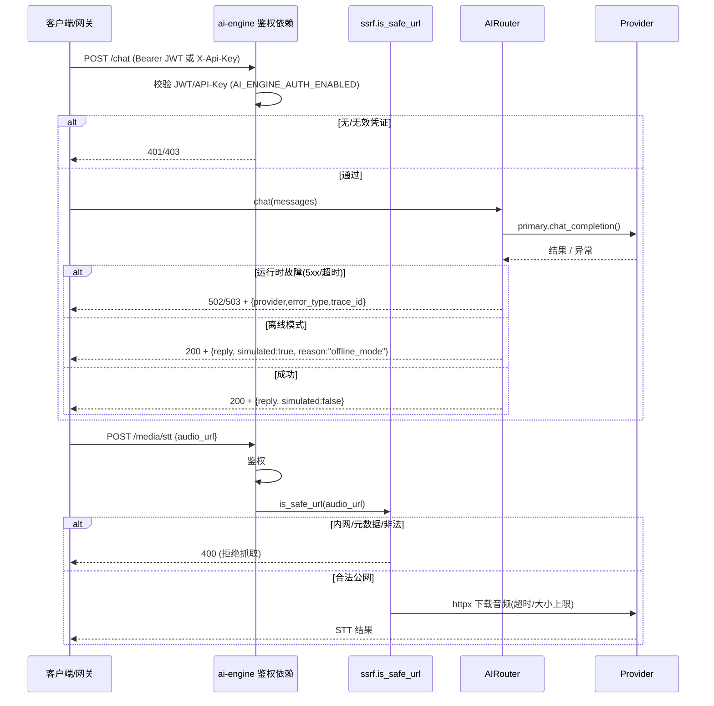

# SmartLearn AI 增量整改设计（整改设计-2026-07-08）

> 文档版本: v1.0 ｜ 日期: 2026-07-08 ｜ 作者: 高见远（架构师）
> 依据:
> - 《全量代码审查报告-2026-07-08.md》（权威事实来源，约 293 源码文件 + 21 数据文件逐文件审查）
> - 《整改 PRD-2026-07-08.md》（目标 G1 可部署 / G2 基本安全 / G3 文档自洽 / G4 数据可灌 / G5 功能不空心）
> 主理人已拍板 4 项待确认（直接采纳，不再问用户）:
> 1. web / mobile-web 从 `docker-compose.yml` 移除生产服务；`apps/web`、`apps/mobile-web` 目录保留，各加 `README.md` 标注「规划中模块」。
> 2. 词汇规模对齐真实值（约 520 条）；README 改为「CET4/4541+ 目标，当前已录入 520，持续扩充」。
> 3. 真题/习题册本轮仅补 schema + 代表性样例（每类 3–5 条真实风格样例），真实大规模数据后续导入。
> 4. 生产安全底线接受「缺密钥/未鉴权即拒绝启动」（fail-fast）。
>
> **范围声明**: 本轮为增量整改，**不新增业务功能、不编造真实考题**，仅做修复 / 对齐 / 补结构。无代码产出，仅有设计与任务分解。

---

## 1. 实现方案与框架选型

框架选型**不变**：前端 React 系（admin=React+AntD、student-web=React+Vite、mobile=React Native+Expo）、后端 FastAPI+SQLAlchemy2.0+Alembic（api）/ FastAPI+多供应商抽象层（ai-engine）。本轮只对**已偏离事实的配置、安全缺口、部署阻断**做纠偏。

### 1.1 前端构建/配置纠偏（组A）

- **admin**：`package.json` 当前写成 Vue 栈（`vue/element-plus/pinia/vue-tsc`），但源码是 React+AntD。修正依赖为真实 React 栈，`build` 改为 `vite build`；`Dockerfile.admin` 缺被 `COPY` 的 `nginx.conf` 且用 `npm ci` 无 lock → 新增 `apps/admin/nginx.conf`，并将 `npm ci` 改为 `npm install`（兜底无 lock），HEALTHCHECK 改用 `wget`（nginx:alpine 无 curl）。
- **student-web**：`Dockerfile.student` 单阶段 + 无 nginx 反代 → 改为多阶段（vite build → nginx 承载），新增 `apps/student-web/nginx.conf` 做 `/api` 反向代理 + SPA `try_files $uri /index.html` fallback；前端 API baseURL 通过**构建期环境变量**（`VITE_API_BASE_URL` → `import.meta.env`）注入，不再默认空串。
- **mobile**：`package.json` 的 `"main": "expo-router/entry"` 与无 `app/` 目录、实际入口 `App.tsx` 冲突；缺少 `lottie-react-native`。**统一入口方案（推荐，最小改动）**：移除 `app.json` 的 `expo-router` 插件与 `experiments.typedRoutes`，`"main"` 指向 `node_modules/expo/AppEntry.js`（Expo 据此加载根 `App.tsx`），保留 `expo-router` 包（无害）；在 `dependencies` 补 `lottie-react-native`（iOS 另补 `lottie-ios`）。
- **web / mobile-web**：从 compose 移除生产服务（见 1.4），目录保留并加「规划中」README。

### 1.2 后端 api 纠偏（组B）

- **import 脚本复用 ORM/Alembic（P0-5/P0-12）**：`services/api/scripts/import_*.py` 当前用 `psycopg2` + 裸 `CREATE TABLE` 自建表，与 ORM 脱节 → 重写为导入 `app`（ORM 模型 + `SessionLocal`）经 `bulk_insert_mappings`/ORM 对象写入，删除全部 `CREATE TABLE`；`sys.path` 注入 `services/api` 根以便 `import app`。`import_all.py` 通过 `subprocess` 串联四个脚本（路径指向容器内 `/app/scripts/`）。
- **seed.py 孤儿表（P0-6）**：采用 PRD 选项二——**移除** `achievements` 自建表与 `psycopg2`，改为经 ORM 写入与现有模型一致的初始数据（默认角色/管理员用户等），全库不再有 ORM 未定义的物理表。
- **JWT 生产强制（P0-7/P1-4）**：在 `core/config.py` 增加启动期校验（长度 ≥ 32、不等于代码默认 `change-me-in-production`、不等于 `.env.example` 占位串、不属于已知弱密钥集合）；`main.py` 启动守卫在 `ENVIRONMENT=production` 且校验不通过时 `sys.exit(1)` 并打印明确错误。任何"弱密码仅前缀匹配"的校验统一升级为精确相等 + 强度校验。
- **/system/restore 路径遍历（P1-3）**：`system.py` 对备份 id 做白名单正则 `^[A-Za-z0-9_\-]+$`，`os.path.join(BACKUP_DIR, id)` 后 `os.path.realpath` 必须仍位于 `BACKUP_DIR` 内，否则拒绝（禁止 `..` 跳出）。
- **/vocab/progress func.case（P1-5）**：`vocab.py:129-135` 误用 `func.case`（生成非法 PG 函数调用）→ 改从 `sqlalchemy` 导入 `case` 表达式构造（`case((cond, val), else_=val)`）。

### 1.3 ai-engine 安全（组C）

- **全局鉴权中间件（P0-8）**：新增 `app/auth.py`，提供 FastAPI 依赖 `require_auth()`：校验请求头 `Authorization: Bearer <JWT>`（复用 api 的 `JWT_SECRET`/`JWT_ALGORITHM`，由 compose 注入相同值）或 `X-Api-Key`（= `AI_ENGINE_API_KEY`）；由 `AI_ENGINE_AUTH_ENABLED` 开关控制。对 `/chat`、`/moderation`、`/media/*`、`POST /prompts`、`/word-games` 等写/敏感路由挂依赖；`/health`、`/docs`、`/openapi.json` 豁免。`main.py` 注册依赖。
- **/media/stt SSRF（P0-9）**：新增 `app/security/ssrf.py` 的 `is_safe_url(url, allowlist=[])`：仅允许 `http/https`；解析主机 IP 后拒绝私有/环回/链路本地/云元数据段（`169.254.169.254` 等）；禁用跟随跨网段重定向（或逐步校验每个重定向目标）；设请求超时与响应大小上限。`media_router.py` 在 `httpx` 下载前先经 `is_safe_url` 校验（保留同步 `httpx` 调用，异步化 P1-1 不纳入本轮）。
- **POST /prompts/{id} 归属校验（P0-10）**：在 C1 鉴权基础上，prompt 写接口限定为 **service/admin 密钥**（即持有 `AI_ENGINE_API_KEY` 或 JWT 中 `role=admin`），普通用户令牌 → 403，目标不存在 → 404（不泄露存在性），并记审计日志。
- **provider 异常不再静默 mock（P0-11）**：`providers/router.py` 明确区分两类结果——
  - *离线模式*（`settings.offline_mode`，即未配置任何 provider）：返回模拟内容，但显式标注 `simulated: true` + `reason="offline_mode"`，不伪装为真实 AI。
  - *运行时故障*（provider 已配置且非离线，但调用抛 5xx/限流/超时）：**向上抛出** `ProviderUnavailableError(provider, error_type, trace_id)`，不再回退到静默 mock。
  - `chat_router.py` 捕获 `ProviderUnavailableError` → 返回 HTTP 502/503，响应体含 `{detail, provider, error_type, trace_id}`，并输出结构化日志（provider/错误/计数）供可观测。`ChatResponse` 增加 `simulated`、`reason` 字段。内容审核 `moderate()` 异常改为 **fail-closed**（抛错或返回 `flagged=True`），不再 `flagged=False` 放行。

### 1.4 数据/部署/文档（组D）

- **真题/习题册样例（G5）**：`data/exam-papers/*-real-exams.json` 在现有索引/结构基础上追加 `papers` 数组（数学 math1/2/3、英语 english1/2 各 3–5 份样例卷），每份含完整 `questions`（content/options/answer/solution/analysis/knowledge_points/difficulty/tags），与 `schema.json` 的 `paper_schema` 对齐（注意 `sample_paper` 中 `options` 为对象 `{A,B,C,D}`，样例保持一致）；`data/exercise-books/*-exercise-books.json` 追加每书 3–5 道样例题。全部标注「样例数据，真实大规模真题/习题由版权方后续提供」。这些 JSON 作为 schema 演示与前端展示，**不进入 `make import-*` 流程**（import 仍走 `data/questions`）。
- **词汇规模对齐（P1-12）**：确认 `data/vocabulary/` 合计约 520 条（kaoyan-words 220 + synonyms/word-books/word-frequency）；新增 `data/vocabulary/README.md` 标注「目标 CET4/4541+，当前已录入 520，持续扩充」。
- **Makefile / Dockerfile（P0-12）**：`Makefile` 的 `seed/import-*` 改为容器内绝对路径 `python /app/scripts/<file>.py`；`Dockerfile.api` 增加 `COPY services/api/scripts ./scripts` 使脚本入镜像；`logs-mobile` 因 `mobile-web` 服务移除而改为指向 `mobile`（或无容器则移除）。
- **compose 移除空壳 + nginx 证书条件化（P0-1/P0-13/P0-14）**：
  - 删除 `docker-compose.yml` 中 `web`、`mobile-web` 两个 service 及其在 `nginx.depends_on` 的引用；同步清理 `infra/nginx/nginx.conf` 的 `web_frontend`/`mobile_frontend` upstream。
  - 移除 api/ai-engine 中对已禁用 MinIO 的 `MINIO_ACCESS_KEY/SECRET:?err` 强制要求（改为 `:-` 默认或仅启用 MinIO 时校验）。
  - `.env.example` 补 `POSTGRES_PASSWORD`（非空占位）、`REDIS_PASSWORD`（当前缺失），使 `:?err` 不再因缺变量退出。
  - **nginx 无证书可启动**：将 `default.conf` 的 443 `server` 块拆出为独立 `infra/nginx/conf.d/ssl.conf`，默认 `make up` 仅挂载 80（`default.conf` 改为 80-only，内含 `/nginx-health` 返回 200）；`ssl.conf` + 真实证书经可选的 `infra/docker/docker-compose.ssl.yml` 叠加挂载（文档说明）。`frontend.conf` 中 `mobile` server 块注释掉（mobile-web 已移除）。
  - ai-engine service 注入 `JWT_SECRET`/`JWT_ALGORITHM`/`AI_ENGINE_AUTH_ENABLED`/`AI_ENGINE_API_KEY` 环境变量。
- **README 重写（G3）**：根 `README.md` 如实声明技术栈（FastAPI 非 NestJS；admin=React+AntD 非 Vue；web/mobile-web=规划中）、前端清单、数据规模（数学 5026、英语 3224、词汇 520/CET4 4541+ 目标）、安全门槛（生产弱密钥/未鉴权拒绝启动）、数据待补充声明。
- **.gitignore**：确认已含 `.workbuddy/`（第 128–129 行），无需改动，仅复核。

---

## 2. 文件列表（相对路径 + 动作）

> 动作图例：**改**=修改　**增**=新增　**删**=删除　**确**=确认/无改动

### 组A 前端构建/配置
| 相对路径 | 动作 | 说明 |
|---|---|---|
| `apps/admin/package.json` | 改 | Vue 栈 → React 栈；`build` 改 `vite build` |
| `apps/admin/Dockerfile.admin` | 改 | `npm ci`→`npm install`；HEALTHCHECK 改 `wget` |
| `apps/admin/nginx.conf` | 增 | SPA + `/api` 反代 |
| `apps/student-web/nginx.conf` | 增 | SPA fallback + `/api` 反代 |
| `apps/student-web/Dockerfile.student` | 改 | 多阶段 nginx 承载；注入 API baseURL |
| `apps/student-web/vite.config.ts`（或 src 配置） | 改 | `VITE_API_BASE_URL` → `import.meta.env` |
| `apps/mobile/package.json` | 改 | `main` 统一；加 `lottie-react-native` |
| `apps/mobile/app.json` | 改 | 去 `expo-router` 插件与 `typedRoutes` |
| `apps/web/README.md` | 增 | 标注「规划中模块」 |
| `apps/mobile-web/README.md` | 增 | 标注「规划中模块」 |

### 组B 后端 api
| 相对路径 | 动作 | 说明 |
|---|---|---|
| `services/api/scripts/import_knowledge.py` | 改 | 复用 ORM，删 CREATE TABLE |
| `services/api/scripts/import_questions.py` | 改 | 复用 ORM，删 CREATE TABLE |
| `services/api/scripts/import_vocabulary.py` | 改 | 复用 ORM，删 CREATE TABLE |
| `services/api/scripts/import_all.py` | 改 | 指向 `/app/scripts/` 串联 |
| `services/api/scripts/seed.py` | 改 | 删 achievements 自建表，ORM 写初始数据 |
| `services/api/app/core/config.py` | 改 | JWT 强度校验器 |
| `services/api/app/core/security.py` | 改 | 强化校验（精确相等+强度） |
| `services/api/app/main.py` | 改 | 启动期 fail-fast 守卫 |
| `services/api/app/api/v1/system.py` | 改 | `/system/restore` 路径遍历修复 |
| `services/api/app/api/v1/vocab.py` | 改 | `func.case` → `sqlalchemy.case` |
| `services/api/Dockerfile.api` | 改 | `COPY services/api/scripts ./scripts` |

### 组C ai-engine 安全
| 相对路径 | 动作 | 说明 |
|---|---|---|
| `services/ai-engine/app/auth.py` | 增 | 全局鉴权依赖（JWT/API-Key） |
| `services/ai-engine/app/security/ssrf.py` | 增 | `is_safe_url` 地址校验 |
| `services/ai-engine/app/main.py` | 改 | 挂鉴权依赖；豁免 /health /docs |
| `services/ai-engine/config.py` | 改 | 加 `AI_ENGINE_AUTH_ENABLED`/`AI_ENGINE_API_KEY`/`JWT_*` |
| `services/ai-engine/app/routers/media_router.py` | 改 | STT 下载前经 SSRF 校验 |
| `services/ai-engine/app/routers/prompt_router.py` | 改 | 写接口限 service/admin 密钥 |
| `services/ai-engine/app/routers/chat_router.py` | 改 | 捕获故障→502/503；加 simulated/reason |
| `services/ai-engine/app/providers/router.py` | 改 | 区分离线模拟/运行时故障；审核 fail-closed |
| `services/ai-engine/requirements.txt` | 改 | 加 `PyJWT` |

### 组D 数据/部署/文档
| 相对路径 | 动作 | 说明 |
|---|---|---|
| `data/exam-papers/math-real-exams.json` | 改 | 追加样例卷（3–5 份/科） |
| `data/exam-papers/english-real-exams.json` | 改 | 追加样例卷（3–5 份/科） |
| `data/exam-papers/schema.json` | 确/改 | 对齐 `paper_schema`（options 对象结构） |
| `data/exercise-books/math-exercise-books.json` | 改 | 追加样例题（每书 3–5 道） |
| `data/exercise-books/english-exercise-books.json` | 改 | 追加样例题（每书 3–5 道） |
| `data/exercise-books/schema.json` | 确/改 | 对齐习题册题目 schema |
| `data/vocabulary/README.md` | 增 | 「目标 CET4/4541+，当前 520，持续扩充」 |
| `docker-compose.yml` | 改 | 删 web/mobile-web；去 MINIO `:?err`；ai-engine 加鉴权 env |
| `.env.example` | 改 | 补 `POSTGRES_PASSWORD`/`REDIS_PASSWORD`；加 ai-engine 鉴权变量 |
| `Makefile` | 改 | `seed/import-*` 指向 `/app/scripts/`；修 `logs-mobile` |
| `infra/nginx/nginx.conf` | 改 | 删 `web_frontend`/`mobile_frontend` upstream |
| `infra/nginx/conf.d/default.conf` | 改 | 改 80-only + `/nginx-health`；`/`→student_frontend；去 `/m`/`/static-mobile` |
| `infra/nginx/conf.d/frontend.conf` | 改 | 注释 mobile server 块 |
| `infra/nginx/conf.d/ssl.conf` | 增 | 443 server（条件挂载，默认不挂载） |
| `infra/nginx/ssl/.gitkeep` | 增 | 占位使 `/etc/nginx/ssl` 存在 |
| `infra/docker/docker-compose.ssl.yml` | 增 | 可选 SSL 叠加文件（文档说明） |
| `README.md` | 改 | 重写：真实技术栈/前端清单/数据规模/安全门槛 |
| `.gitignore` | 确 | 已含 `.workbuddy/`，复核无改动 |

---

## 3. 任务列表（按模块分组 + 实现顺序）

> 四组（A/B/C/D）**可并行开发**；集成在组D（D4/D5/D6）收口；最终端到端验证 G1–G5。
> 每任务含：任务ID · 目标文件 · 具体动作 · 依赖 · 验收标准。

### 组A 前端构建/配置（可并行）

**A1 — admin 依赖与构建纠偏**
- 目标文件：`apps/admin/package.json`、`apps/admin/Dockerfile.admin`、`apps/admin/nginx.conf`
- 具体动作：package.json 依赖改 React 栈（`react`/`react-dom`/`antd`/`@ant-design/pro-components`/`zustand`/`axios`/`echarts`；dev:`@vitejs/plugin-react`/`vite`/`typescript`/`eslint`/`@types/react`/`@types/react-dom`），`build`→`vite build`；Dockerfile `npm ci`→`npm install`、HEALTHCHECK 改 `wget`；新增 nginx.conf（root `/usr/share/nginx/html`、`try_files` 兜底、`/api`→`api:8000`）。
- 依赖：无
- 验收：`npm install` 成功且依赖为 React 栈；`npm run build` 产出 `dist/`；`docker build -f apps/admin/Dockerfile.admin .` 成功（nginx.conf 存在）；package.json 不再出现 `vue`/`element-plus`/`pinia`/`vue-tsc`。

**A2 — student-web 生产反代 + SPA fallback**
- 目标文件：`apps/student-web/nginx.conf`、`apps/student-web/Dockerfile.student`、`apps/student-web/vite.config.ts`（及 baseURL 注入点）
- 具体动作：多阶段构建（vite build → nginx）；nginx.conf 配 `/api`→`api:8000` 反代 + `try_files $uri /index.html`；通过 `VITE_API_BASE_URL` 构建变量注入 API baseURL（不再空串）。
- 依赖：无
- 验收：容器内深链接刷新返回 index.html（不 404）；经 nginx 代理 `/health` 可达；baseURL 非空。

**A3 — mobile 入口统一 + lottie 依赖**
- 目标文件：`apps/mobile/package.json`、`apps/mobile/app.json`
- 具体动作：`app.json` 移除 `expo-router` 插件与 `experiments.typedRoutes`；package.json `"main"`→`node_modules/expo/AppEntry.js`；`dependencies` 加 `lottie-react-native`（iOS 加 `lottie-ios`）。
- 依赖：无
- 验收：`npm install` 无缺失依赖报错；`expo start` 正常加载 `App.tsx`，无 "main entry conflict" / "module not found" 崩溃。

**A4 — web/mobile-web 规划中标注**
- 目标文件：`apps/web/README.md`、`apps/mobile-web/README.md`
- 具体动作：两目录各新增 `README.md`，注明「规划中模块，暂未实现；编排已自 docker-compose 移除」。
- 依赖：无
- 验收：两 README 存在且含「规划中」字样；compose 中已无对应 service（见 D5）。

### 组B 后端 api（可并行，B2 建议随 B1）

**B1 — import 脚本复用 ORM**
- 目标文件：`services/api/scripts/import_knowledge.py`、`import_questions.py`、`import_vocabulary.py`、`import_all.py`
- 具体动作：`sys.path.insert(0, API_ROOT)` 导入 `app`（ORM+`SessionLocal`）；用 `bulk_insert_mappings`/ORM 写入，删除全部 `CREATE TABLE`；字段映射对齐 ORM 列名；统一 upsert（ON CONFLICT）；`import_all.py` 串联 `/app/scripts/` 下脚本。
- 依赖：无
- 验收：在 `make migrate` 后的库运行 `make import-all` 无 SQL 冲突；导入量与 `data/*.json` 一致（数学 5026、英语 3224）；脚本中无 `CREATE TABLE`。

**B2 — seed.py 孤儿表处理**
- 目标文件：`services/api/scripts/seed.py`
- 具体动作：删除 `achievements` 自建表与 `psycopg2`；改为经 ORM 写入与现有模型一致的初始数据（默认角色/管理员用户等），upsert 幂等。
- 依赖：B1（共用 ORM 导入方式）
- 验收：全库无 ORM 未定义的物理表；`make seed` 成功；无"表不存在/列不匹配"报错。

**B3 — JWT 生产强制（fail-fast）**
- 目标文件：`services/api/app/core/config.py`、`services/api/app/core/security.py`、`services/api/app/main.py`
- 具体动作：`config.py` 增加 JWT 强度校验（长度≥32、≠`change-me-in-production`、≠`.env.example` 占位、∉已知弱集合）；`main.py` 启动守卫在 `ENVIRONMENT=production` 校验失败即 `sys.exit(1)` 并打印明确错误；`security.py` 弱校验升级为精确相等+强度。
- 依赖：无
- 验收：用默认/弱密钥启动生产 → 进程退出并打印错误；用 `openssl rand -hex 32` 密钥 → 正常启动且 token 可被正确校验。

**B4 — /system/restore 路径遍历修复**
- 目标文件：`services/api/app/api/v1/system.py`
- 具体动作：备份 id 白名单正则 `^[A-Za-z0-9_\-]+$`；`realpath(join(BACKUP_DIR, id))` 必须仍位于 `BACKUP_DIR` 内，否则拒绝。
- 依赖：无
- 验收：传入 `../../etc/passwd` 类路径被拒；合法备份 id 正常执行。

**B5 — /vocab/progress func.case 修复**
- 目标文件：`services/api/app/api/v1/vocab.py`
- 具体动作：将 `func.case((cond, val), else_=0)`（129–135 行）改为 `from sqlalchemy import case` 的 `case((cond, val), else_=0)` 表达式。
- 依赖：无
- 验收：PG 下 `/vocab/progress` 不再报 SQL 语法错误；返回统计正确。

### 组C ai-engine 安全（C1 为先，C2/C3 依赖 C1，C4 可并行）

**C1 — 全局鉴权中间件**
- 目标文件：`services/ai-engine/app/auth.py`、`services/ai-engine/app/main.py`、`services/ai-engine/config.py`
- 具体动作：新增 `auth.py` 提供 `require_auth()`（校验 `Authorization: Bearer <JWT>` 复用 api `JWT_SECRET`/`JWT_ALGORITHM`，或 `X-Api-Key`=`AI_ENGINE_API_KEY`；`AI_ENGINE_AUTH_ENABLED` 控制）；`main.py` 对 `/chat`、`/moderation`、`/media/*`、`POST /prompts`、`/word-games` 挂依赖；豁免 `/health`、`/docs`、`/openapi.json`；`config.py` 加对应设置。
- 依赖：无
- 验收：匿名调 `POST /chat`/`POST /media/stt`/`POST /prompts` → 401/403；持合法凭证 → 200；缺 `JWT_SECRET`/`AI_ENGINE_API_KEY` 且 `AI_ENGINE_AUTH_ENABLED=true` 时启动失败。

**C2 — /media/stt SSRF 防护**
- 目标文件：`services/ai-engine/app/security/ssrf.py`、`services/ai-engine/app/routers/media_router.py`
- 具体动作：新增 `ssrf.py` 的 `is_safe_url`（仅 http/https；解析 IP 拒绝私有/环回/链路本地/元数据 `169.254.169.254`；禁用跨网段重定向；超时+响应大小上限；可经 `AI_ENGINE_SSRF_ALLOWLIST` 配域名白名单）；`media_router.py` 下载前先校验。
- 依赖：C1
- 验收：请求 `http://169.254.169.254/`、`http://localhost/` 被拒；合法公网音频 URL 正常；超时/大小上限生效。

**C3 — POST /prompts/{id} 归属校验**
- 目标文件：`services/ai-engine/app/routers/prompt_router.py`
- 具体动作：在 C1 鉴权基础上，写接口限定 service/admin 密钥；越权 → 403，目标不存在 → 404（不泄露存在性）；记录审计。
- 依赖：C1
- 验收：非 admin/service 令牌改 prompt → 403；持有 service 密钥成功且留审计。

**C4 — provider 异常不再静默 mock**
- 目标文件：`services/ai-engine/app/providers/router.py`、`services/ai-engine/app/routers/chat_router.py`
- 具体动作：`router.py` 区分离线模拟（标 `simulated:true`+`reason`）与运行时故障（抛 `ProviderUnavailableError`）；`chat_router.py` 捕获→502/503+结构化日志，`ChatResponse` 加 `simulated`/`reason`；`moderate()` 异常改 fail-closed。
- 依赖：无（与 C1 并行）
- 验收：供应商 500/429 → 接口返回错误（非 200 假答案）且日志含 provider/错误；离线模式模拟响应对调用方透明标注；单测覆盖故障分支。

### 组D 数据/部署/文档（集成收口）

**D1 — 真题 schema + 样例**
- 目标文件：`data/exam-papers/math-real-exams.json`、`english-real-exams.json`、`schema.json`
- 具体动作：在现有索引/结构下追加 `papers`（math1/2/3、english1/2 各 3–5 份），每卷含完整 `questions` 字段；`schema.json` 对齐 `paper_schema`（options 用对象 `{A,B,C,D}`，与 `sample_paper` 一致）；文件头标注「样例数据，真实大规模真题后续提供」。
- 依赖：无
- 验收：JSON 可解析；样例题字段完整、与 schema 一致；`knowledge_points` 引用合法。

**D2 — 习题册 schema + 样例**
- 目标文件：`data/exercise-books/math-exercise-books.json`、`english-exercise-books.json`、`schema.json`
- 具体动作：每书追加 3–5 道样例题（含答案/解析/知识点）；schema 对齐；标注「样例，真实数据后续提供」。
- 依赖：无
- 验收：JSON 可解析；样例题字段完整自洽。

**D3 — 词汇规模对齐**
- 目标文件：`data/vocabulary/README.md`
- 具体动作：新增 README 标注「目标 CET4/4541+，当前已录入约 520 条（kaoyan-words 220 + synonyms/word-books/word-frequency），持续扩充」。
- 依赖：无
- 验收：README 存在且规模声明与真实值（≈520）一致。

**D4 — Makefile / Dockerfile 脚本路径修正**
- 目标文件：`Makefile`、`services/api/Dockerfile.api`
- 具体动作：`Dockerfile.api` 增 `COPY services/api/scripts ./scripts`；`Makefile` 的 `seed/import-*` 改 `python /app/scripts/<file>.py`；`logs-mobile` 因 `mobile-web` 移除改为指向 `mobile` 或移除。
- 依赖：B1（脚本位置确认）
- 验收：`make seed`、`make import-kp/q/vocab/all` 在容器内成功，无 "No such file"；数据入库存量一致。

**D5 — compose 移除空壳 + nginx 证书条件化 + P0-13/14 修复**
- 目标文件：`docker-compose.yml`、`.env.example`、`infra/nginx/nginx.conf`、`infra/nginx/conf.d/default.conf`、`frontend.conf`、`infra/nginx/conf.d/ssl.conf`（增）、`infra/nginx/ssl/.gitkeep`（增）、`infra/docker/docker-compose.ssl.yml`（增）
- 具体动作：删 `web`/`mobile-web` service 及 `nginx.depends_on` 中引用；`nginx.conf` 删 `web_frontend`/`mobile_frontend` upstream；移除 api/ai-engine 的 MinIO `:?err`；`.env.example` 补 `POSTGRES_PASSWORD`(非空)/`REDIS_PASSWORD` 与 ai-engine 鉴权变量；`default.conf` 改 80-only 且含 `/nginx-health`(200)、`/`→student_frontend、去 `/m`/`/static-mobile`；拆出 `ssl.conf`（443，默认不挂载）；`frontend.conf` 注释 mobile server；ai-engine 注入 `JWT_SECRET`/`JWT_ALGORITHM`/`AI_ENGINE_AUTH_ENABLED`/`AI_ENGINE_API_KEY`。
- 依赖：A4（web/mobile-web 已标注）、C1（ai-engine 鉴权 env 已定义）
- 验收：`docker compose config` 通过且 service 列表无 web/mobile-web；无证书 `make up` 后 nginx healthcheck 绿；`curl http://localhost/nginx-health` 返回 200；仅填最低必填+密码即可 `make up` 无 `err` 中断。

**D6 — README 重写**
- 目标文件：`README.md`
- 具体动作：如实声明技术栈（FastAPI 非 NestJS；admin=React+AntD 非 Vue；web/mobile-web=规划中）、前端清单（admin/mobile/student-web）、数据规模（数学 5026、英语 3224、词汇 520/CET4 4541+ 目标）、安全门槛（生产弱密钥/未鉴权拒绝启动）、数据待补充声明。
- 依赖：D1、D2、D3、D5
- 验收：README 与代码真实状态一致；空壳模块明确标注「规划中」；含「真题/习题真实数据待后续提供」声明。

**D7 — .gitignore 确认 .workbuddy**
- 目标文件：`.gitignore`
- 具体动作：复核已含 `.workbuddy/` 与 `**/.workbuddy/`（第 128–129 行），无需改动。
- 依赖：无
- 验收：`.gitignore` 含 `.workbuddy/`；`git status` 不追踪 `.workbuddy/`。

---

## 4. 依赖包变更

### npm（前端）
| 包 | 应用 | 动作 | 说明 |
|---|---|---|---|
| `lottie-react-native`（+`lottie-ios` iOS） | mobile | 新增 | 修复 `AchievementPopup` 缺包崩溃 |
| `vue`/`vue-router`/`pinia`/`element-plus`/`@element-plus/icons-vue`/`@vitejs/plugin-vue`/`vue-tsc` | admin | 移除 | 实际为 React 栈 |
| `react`/`react-dom`/`antd`/`@ant-design/pro-components`/`zustand`/`axios`/`echarts`/`@vitejs/plugin-react`/`vite`/`typescript`/`eslint`/`@types/react`/`@types/react-dom` | admin | 新增 | 对齐真实 React 栈 |
| （无新增） | student-web | — | 用 `import.meta.env.VITE_API_BASE_URL` 注入，不引入新包 |

### pip（Python）
| 包 | 服务 | 动作 | 说明 |
|---|---|---|---|
| `PyJWT` | ai-engine | 新增 | JWT 校验复用 api 中间件（与 api 共享 `JWT_SECRET`） |
| `langchain`/`pymilvus`（未使用） | ai-engine | 保留/标注 | P2 清理项，本轮不动，仅标注未使用 |
| （无新增） | api | — | 已有 sqlalchemy/psycopg2/PyJWT/jwt |

---

## 5. 共享约定（跨文件）

1. **统一 JWT 校验函数位置**
   - api：`services/api/app/core/security.py` 现有 `decode_token`/`create_token`（基于 `JWT_SECRET`/`JWT_ALGORITHM`）。
   - ai-engine：新增 `services/ai-engine/app/auth.py` 的 `verify_token()`，复用**同一** `JWT_SECRET`/`JWT_ALGORITHM`（compose 向两服务注入相同值）；同时支持 `X-Api-Key`=`AI_ENGINE_API_KEY` 作为服务间/网关凭证。
2. **错误响应格式**
   - api：沿用现有 `{ "detail": "..." }`（FastAPI HTTPException）。
   - ai-engine 故障：返回 HTTP 502/503，体为 `{ "detail": str, "provider": str, "error_type": str, "trace_id": str }`；离线模拟响应在业务体标注 `simulated: true` + `reason`（如 `offline_mode`），不伪装为真实 AI 输出。
3. **SSRF 地址校验白名单位置**
   - `services/ai-engine/app/security/ssrf.py` 提供 `is_safe_url(url, allowlist: list[str] = [])`；默认拒绝私有/环回/链路本地/云元数据段；允许经环境变量 `AI_ENGINE_SSRF_ALLOWLIST`（逗号分隔域名）扩展白名单。所有服务端出网抓取（STT 等）必须先过此函数。
4. **启动安全门槛（fail-fast）**
   - api：`ENVIRONMENT=production` 且 `JWT_SECRET` 弱/默认 → `sys.exit(1)`。
   - ai-engine：`AI_ENGINE_AUTH_ENABLED=true` 且缺 `JWT_SECRET`/`AI_ENGINE_API_KEY` → 拒绝启动。
   - 两服务均实现启动期校验，宁可启动失败也不暴露不安全服务。
5. **数据脚本统一入口**
   - 所有 `services/api/scripts/*.py`：`sys.path.insert(0, API_ROOT)` 导入 `app`，经 `app.db.session.SessionLocal` 写入；全部用 upsert（ON CONFLICT）保证幂等；不再出现裸 `CREATE TABLE`。

---

## 6. 待明确事项（仅真正无法判定者）

1. **mobile 入口二选一已定**：本报告取「移除 expo-router 插件 + `main: node_modules/expo/AppEntry.js`」最小方案（保留 `App.tsx`）。若团队后续偏好 Expo 文件路由，则需建立 `app/` 目录结构（超出本轮最小改动，需另行排期）。
2. **exam-papers / exercise-books 样例与 `data/questions` 的关系**：样例 JSON 仅作 schema 演示与前端展示，**不进入 `make import-*`**（import 仍走 `data/questions` 的 8250 题）。需确认前端是直接读取 `data/exam-papers` JSON 还是走 API —— 本轮不新增 API，仅保证 JSON 自洽可加载；若前端需经 API 提供真题，属后续功能（超出本轮范围）。
3. **achievements 表**：本轮按 PRD P0-6 选项二「移除孤儿表」处理（不实现成就系统）。若产品要求保留成就，则需新增 `Achievement` ORM + Alembic 迁移（属新增业务功能，超出本轮「不新增」边界），需产品另行确认。
4. **开发环境 SSL**：默认 `make up` 走 80（无证书）；`ssl.conf` + 真实证书经可选 `infra/docker/docker-compose.ssl.yml` 叠加。是否需额外提供一键 `make ssl-selfsign` 自签脚本为可选增强（P2），本期未强制。
5. **ai-engine 多 worker 共享状态**：`--workers 2` 下 `word_games` 进程内字典无锁/跨 worker 不共享（P1 项）本轮未纳入四组，建议在后续迭代以 Redis/DB 后端替代，本期标注为已知限制。

---

## 附：实现顺序总览（端到端）

1. **并行开发（无相互阻塞）**：组A（A1–A4）、组B（B1–B5）、组C（C1 先行，C2/C3 随 C1，C4 并行）、组D 准备（D1–D3、D7）。
2. **集成收口**：D4（依赖 B1）→ D5（依赖 A4、C1）→ D6（依赖 D1–D3、D5）。
3. **验证（G1–G5）**：
   - `cp .env.example .env` → 填 `JWT_SECRET`(≥32)、`POSTGRES_PASSWORD`、`REDIS_PASSWORD`、至少 1 个 AI Key → `make up`（全栈无 web/mobile-web，健康检查绿）。
   - `make migrate && make seed && make import-all` → 数据按真实规模入库存量一致。
   - 生产弱密钥/ai-engine 未鉴权 → 拒绝启动；匿名调敏感接口 → 401/403；供应商故障 → 显式报错；SSRF/越权写被拦截。
   - README/文档与代码一致；真题/习题册/词汇具备 schema+样例且可加载。
